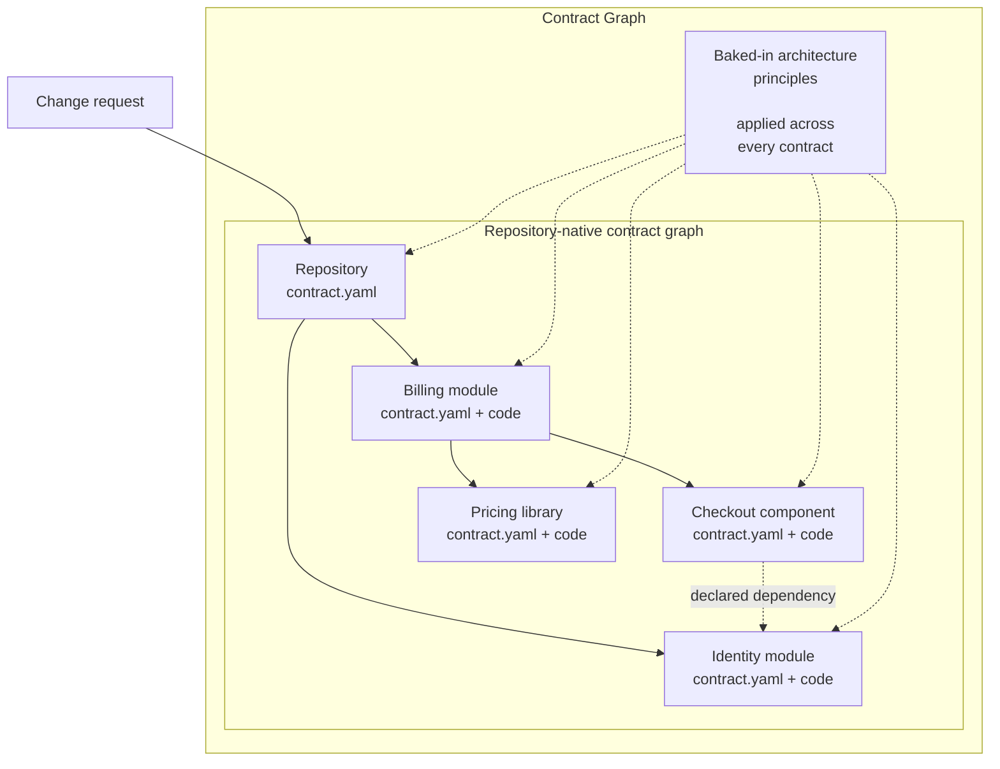

<p align="center">
  <picture>
    <source media="(prefers-color-scheme: dark)" srcset="https://contractgraph.dev/assets/contract-graph-mark-white.webp">
    
  </picture>
</p>

# Contract Graph

**Scale model-driven development with repository-native contracts as durable context.**

- [Quick Introduction Video](https://contractgraph.dev/#watch)
- [Why is software context structured as a graph?](https://contractgraph.dev/docs/vision/)

Contract Graph makes software understandable to coding agents as a repository-native, traversable context map. Agents can not only locate the precise place to make a change efficiently, but also preserve that context alongside the code for future work. Each contract explains what its unit owns, how its parent uses it, and where to read next.

## How it works

Contract Graph ships a baked-in, opinionated architecture for decomposing a repository into modules, sub-modules, components, and libraries. Each boundary keeps a `contract.yaml` beside its code, recording its responsibility, public surface, relationships, invariants, and verification. The architecture is therefore stored with the implementation, rather than living only in diagrams, prompts, or institutional memory.

For each task, an agent starts at the repository contract and follows only the relevant child and dependency edges to the smallest responsible boundary. It reads and changes the code there, keeps the affected contracts truthful, and runs their declared checks. The next agent inherits that updated map rather than rediscovering the system from scratch.



Choose the mode that matches how clearly you understand the outcome.

## Choose how to work

| Mode | Start here when… | Your involvement |
|---|---|---|
| **Product Prototyping** | You need to try a working experience before deciding exactly what to build. | Use the preview, give feedback, approve the experience, then ask the agent to finish it. |
| **Sprint and Epic Delivery** | The outcome is understood, and you want an agreed goal and reviewable increments. | Agree outcomes and criteria, review the working result, and let the agent finish within the requested sprint or epic scope. |

### Product Prototyping

Use `/cg-prototype` when you want to discover the right experience by trying it:

```text
/cg-prototype
Improve the dashboard layout and interactions. Launch it and iterate with me.
```

Review the preview and give feedback in the same conversation. When the experience is right, explicitly approve it and ask the agent to complete it with `/cg-sign-off`. See the
[prototype guide](https://contractgraph.dev/docs/prototype/) for the full workflow.

### Sprint and Epic Delivery

Use `/cg-plan` when the outcome and its constraints are already clear:

```text
/cg-plan
Add export and import for saved dashboards, including validation and recovery.
```

Agree the goal, expected behavior and review conditions in one Sprint Plan or Epic Plan. Ask the agent to complete the selected sprint: `/cg-produce` implements the items for review, and `/cg-sign-off` finishes tests, documentation and verification under the same request. Produce asks whether to review all ready items together or each item separately, and continues independent work when another item needs your input. See the
[delivery workflow](https://contractgraph.dev/docs/workflow/) for stages, gates, and recovery.

## Get Started

Contract Graph requires Node.js 18.17 or newer. Install the CLI once, then enter the repository you
want to work with:

```bash
npm install --global contract-graph
cd your-repository
```

| New repository | Existing repository |
|---|---|
| Run `cg init`, then `/cg-warmup`. | Run `cg init`, then `/cg-warmup`. |
| Confirm project intent and establish root context. | Confirm intent from existing documents and map the current code. |

Behind the scenes, `cg init` installs the schemas, structural principles, agent skills, hooks, and editor discovery files that make the contract graph usable. It records the installed version and selected profiles without adding a runtime dependency to your application. `cg modules` identifies mapping gaps, while `cg verify` checks that the authored graph remains valid and connected. `cg intent verify` separately checks owner-attributed intent approval and freshness.

## Learn More

- [Getting started](https://contractgraph.dev/start/) and [Docs hub](https://contractgraph.dev/docs/)
- [Contracts](https://contractgraph.dev/docs/contracts/) — contract structure and verification limits.
- [Prototype](https://contractgraph.dev/docs/prototype/) — the feedback loop, acceptance, and completion.
- [Workflow](https://contractgraph.dev/docs/workflow/) and [Lifecycle](https://contractgraph.dev/docs/lifecycle/) — shared delivery stages.
- [Upgrade](https://contractgraph.dev/docs/upgrade/) — update an existing Contract Graph installation.
- [Public schemas](https://contractgraph.dev/schema/) — JSON Schema identities.
- [Contributing](https://github.com/sarada-io/contract-graph/blob/main/CONTRIBUTING.md) — tests, packaging, and publication.
- [Preprint](https://doi.org/10.5281/zenodo.22301753)

## Licence

Licensed under the [Apache License, Version 2.0](https://www.apache.org/licenses/LICENSE-2.0).
