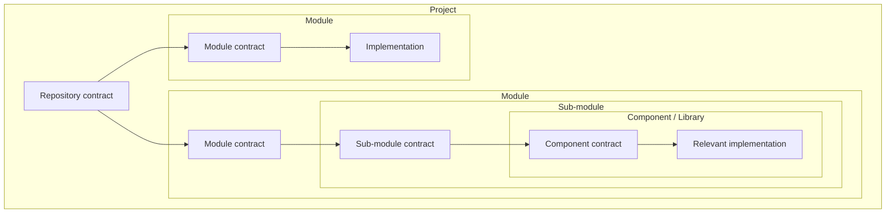

# Contract Graph

**Scale model-driven development with contracts, not shared context.**

Coding models have inflated the speed at which software can be produced. The harder problem is now
keeping that software understandable, bounded, and maintainable as changes accumulate faster than
people can rebuild the architecture in their heads.

Contract Graph turns a repository into a traversable hierarchy of contracts: project → module →
sub-module → component or library. Each contract explains how its unit is used by its parent, what
it owns, where its boundary is, and which contract to read next. An agent gets the overview first,
then descends to the smallest relevant implementation instead of searching the whole repository.

Contract Graph grew from six months of ground-up use across several products. It is an extraction
from repeated delivery and maintenance work, not a framework designed only on paper.

## The problem contracts solve

Faster code generation increases four pressures at once:

| Pressure | Contract-based response |
|---|---|
| More changes land in less time | Stable boundaries keep callers and implementations from changing together by accident. |
| New code spreads responsibility | Modules, sub-modules, and components confine change and structural pollution to an explicit boundary. |
| More agents need to work at once | Contracts provide the decoupling seam needed to reason about independent work. |
| Maintenance grows with every shortcut | The contract graph preserves an overview of the software that later sessions can traverse. |

Abstraction is what lets a codebase scale beyond the amount of implementation any one person or
model can hold in context. Contracts make that abstraction explicit, navigable, and reviewable.

## Software as a contract graph



The boxes are abstraction boundaries; the arrows are context routes. The repository contract gives
the system overview. A module contract explains that module in the project. Its child contracts
progressively narrow the responsibility until the relevant code is small enough to inspect
directly.

Real software also has lateral edges: one module consumes another module's public contract, or a
task enters two branches. The hierarchy is the graph's spine, not a claim that software is a pure
tree.

## How an agent uses it

```text
request
  → routing map
  → module contract
  → sub-module contract
  → relevant implementation
  → boundary-specific verification
```

The agent reads code, but only after the contracts have located the change. That replaces broad
architectural rediscovery with bounded code reading.

A useful contract answers:

- why this unit exists and how its parent uses it;
- what it owns and what is outside its boundary;
- which public entry points cross the boundary;
- which child or sibling contracts carry the next context;
- which invariants and dependency directions must remain true; and
- how to verify a change confined to the unit.

The result is both a better overview of the whole system and a smaller working surface for one
change.

## What works today

| Capability | Shipped behavior |
|---|---|
| Contract hierarchy | Repository and mapped-folder `contract.md` nodes with required boundaries, entry points, invariants, verification, and child-contract routes. |
| Task routing | `map/routing.md` directs a request to its first module contracts. |
| Brownfield adoption | `cg-warmup` discovers real module roots and writes their first contracts from the code that exists. |
| Rule binding | Architecture and product rules are inherited into mapped contracts; generated blocks are synchronized and checked for drift. |
| Honest enforcement | Machine-expressible rules owe detector rows, and contract shape, transient-plan references, mappings, and generated artifacts are verified. |
| Agent discovery | Selectable profiles generate entry points for Claude Code, Codex, GitHub Copilot, and Antigravity. |
| Delivery lifecycle | Seven skills cover planning, preparation, serial production, sign-off, unblocking, brownfield warmup, and opt-in unattended traversal. |
| State-derived routing | `cg next` reads the Step queue from disk; `cg residue` finds planning artifacts no roadmap claims. |

Everything is plain Markdown, JSON, and JavaScript. The package has no runtime dependencies.

## Quick start

### New repository

```bash
npx contract-graph init .
```

This scaffolds the contract system, generates its discovery files, verifies it, and names the next
action. Re-running `init` updates framework-owned assets while preserving repository-owned context.
The starter module shows the contract shape; fill the repository identity and routing map, then
follow the printed route.

### Existing repository

```bash
npx contract-graph init .
npx contract-graph modules
```

Brownfield initialization deliberately does not invent a `src/` module. It reports detected module
roots as unmapped; run the scaffolded `cg-warmup` skill once to write contracts and routing for the
software that is actually there.

## Main commands

| Command | Purpose |
|---|---|
| `cg init [dir]` | Install or upgrade the scaffold, generate derived artifacts, verify, and print the next action. |
| `cg verify [dir]` | Verify contracts, skills, mappings, principles, and generated state. |
| `cg sync [dir]` | Regenerate inherited blocks and editor discovery artifacts. |
| `cg modules [dir]` | Show detected module roots and whether the graph governs them. |
| `cg next [dir]` | Compute the next lifecycle stage from the Step queue on disk. |
| `cg residue [dir]` | Report unclaimed planning artifacts. |
| `cg harvest <manifest>` | Verify decision promotion and phase-close drainage. |
| `cg profiles` | List bundled editor profiles. |
| `cg --version` | Print the installed version. |

Run `cg --help` for flags and exit behavior.

## Contracts first; governance second

The product is the context graph. Governance exists because a graph that drifts from the code makes
every later session worse.

Contract Graph therefore enforces one foundational rule:

> A rule and its enforcing test land in the same commit.

Rules, detectors, inheritance, and lifecycle controls protect the contracts; they are not a
substitute for useful project context. If enforcement grows while the graph becomes less useful for
locating code, the project has missed its purpose.

## The current boundary

The folder-level context graph, task routing, brownfield mapping, inheritance, synchronization, and
verification are built and tested.

The complete recursive vision is not yet machine-proven. Contract Graph requires every contract to
name its children or declare itself a leaf, but it cannot yet prove that the declared child set is
complete against the implementation. Code-level contract composition, verified closure, and safe
parallel-worker coordination remain upcoming.

Contracts already create the decoupling boundary parallel work needs. What is not yet shipped is
the structural proof that two proposed work areas are fully independent. The project will not call
parallel execution safe until that proof and write confinement exist.

## Read next

- [Vision](docs/vision.md) — the complete concept, origin, causal model, and next structural work.
- [Contracts](docs/contracts.md) — folder contracts, code contracts, abstraction, and current limits.
- [Lifecycle](docs/lifecycle.md) — how the seven skills move work through the graph.
- [Contributing](CONTRIBUTING.md) — tests and contribution expectations.

## Requirements

Node.js 18.17 or newer. No runtime dependencies.

## Licence 

Licensed under Apache-2.0.

Created by [Sarada.io](https://sarada.io).