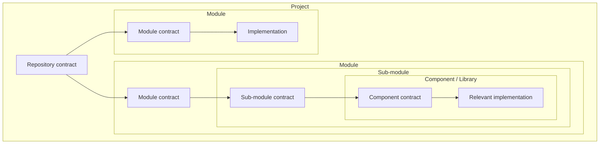

# Contract Graph

**Scale model-driven development with contracts, not shared context.**

Coding models have inflated the speed at which software can be produced. The harder problem is now
keeping that software understandable, bounded, and maintainable as changes accumulate faster than
people can rebuild the architecture in their heads.

Contract Graph turns a repository into a traversable hierarchy of contracts: project → module →
sub-module → component or library. Each contract explains how its unit is used by its parent, what
it owns, where its boundary is, and which contract to read next. An agent gets the overview first,
then descends to the smallest relevant implementation instead of searching the whole repository.

Contract Graph grew from six months of ground-up use across several products. It is an extraction
from repeated delivery and maintenance work, not a framework designed only on paper.

## The problem contracts solve

Faster code generation increases four pressures at once:

| Pressure | Contract-based response |
|---|---|
| More changes land in less time | Stable boundaries keep callers and implementations from changing together by accident. |
| New code spreads responsibility | Modules, sub-modules, and components confine change and structural pollution to an explicit boundary. |
| More agents need to work at once | Contracts provide the decoupling seam needed to reason about independent work. |
| Maintenance grows with every shortcut | The contract graph preserves an overview of the software that later sessions can traverse. |

Abstraction is what lets a codebase scale beyond the amount of implementation any one person or
model can hold in context. Contracts make that abstraction explicit, navigable, and reviewable.

## Software as a contract graph



The boxes are abstraction boundaries; the arrows are context routes. The repository contract gives
the system overview. A module contract explains that module in the project. Its child contracts
progressively narrow the responsibility until the relevant code is small enough to inspect
directly.

Real software also has lateral edges: one module consumes another module's public contract, or a
task enters two branches. The hierarchy is the graph's spine, not a claim that software is a pure
tree.

## How an agent uses it

```text
request
  → contract-owned route
  → module contract
  → sub-module contract
  → relevant implementation
  → boundary-specific verification
```

The agent reads code, but only after the contracts have located the change. That replaces broad
architectural rediscovery with bounded code reading.

When the agent *writes* or extends the graph, `.agents/cg/principles/architecture.yaml` `graph` is the walk,
not a bag of optional fields. The schema requires every key so an installed catalog cannot drop a
step. JSON Schema does not execute the order; the YAML order is the protocol:

| Order | Key | Role |
|---|---|---|
| 1 | `node` | One owned responsibility, one hierarchy kind, one `contract.yaml`. |
| 2 | `recurse` | Apply the rest at every candidate inside the unit. |
| 3 | `selfSufficient` | Does this unit deserve a node (named function, small surface, own change reasons). |
| 4 | `surface` | Enter only through the declared contract surface. Encapsulate internals, algorithms, persistence, framework types, and vendor types behind it. A new entry or a bypass is not stay. |
| 5 | `decide` | **stay**, **add-child**, or **elsewhere** — the only three outcomes. |
| 6 | `compose` | Parent orchestrates; children decompose `owns`. |
| 7 | `stop` | Quit splitting. Not per file; depth is mixed and uncapped; inseparable packages need a named rationale. |
| 8 | `forbid` | A new folder, file, or dependency is not a node. |
| 9 | `adapters` | Vendor split of `surface.encapsulate`: each optional vendor is a child behind a parent-owned port. |

`surface` is core encapsulation, so it sits before `decide`. `adapters` is last because it is not
a fourth decide id; it overrides `forbid` for optional Mongo/PostgreSQL-style splits. Skills apply
that protocol; there is no import scanner, so `cg verify` still only proves declared paths exist.
The [lifecycle](docs/lifecycle.md) spells the same walk for every stage.

A useful contract answers:

- why this unit exists and how its parent uses it;
- what it owns and what is outside its boundary;
- which public entry points cross the boundary;
- which child or sibling contracts carry the next context;
- which invariants and dependency directions must remain true; and
- how to verify a change confined to the unit.

The result is both a better overview of the whole system and a smaller working surface for one
change.

## What Contract Graph binds

Contract Graph is opinionated about software structure, not every software-design choice. Its
authority has four explicit lanes:

| Family | Authority | Source | Loading |
|---|---|---|---|
| `A` | Machine-enforced structural binding | `.agents/cg/principles/architecture.yaml` | Applies to every contract automatically. |
| `P` | Repository-owned product binding | `.agents/cg/guidelines/product.yaml` | Applies only where a contract lists its ID. |
| `E` | Non-binding engineering guidelines | `.agents/cg/guidelines/engineering.yaml` | Consulted as advice; never treated as compliance. |

An `A` entry is binding only because it states one structural invariant, one deterministic
measure, a registered blocking detector, and a negative fixture proving the detector fails on
demand. If any of those is missing, the statement remains guidance.

This boundary makes Contract Graph complementary to SpecKit and similar specification frameworks.
Those tools can own feature specifications, a repository constitution, broader engineering
policy, and the delivery workflow. Contract Graph supplies the structural graph, the recursive
mapping (`hierarchy.kinds` and the `graph` walk: node, recurse, selfSufficient, surface, decide, compose, stop, forbid, adapters),
and the `A` rules that keep an authored graph valid.
When both are installed, replacing `workflow.md` does not replace `.agents/cg/principles/architecture.yaml`.

Non-binding does not mean permanent. An `E` practice may be promoted when structural impact,
deterministic measurement, blocking enforcement, and a negative fixture all exist. Core promotion
is delivered in the codebase that owns the installed verifier: it registers the detector, assigns
the next permanent `A` ID, and removes the D copy in the same change. An adopting repository
cannot turn prose into a built-in detector merely by editing YAML; until its verifier supports the
rule, keep it as D guidance, adopt a product-specific version as `P`, or propose the generic
binding to Contract Graph.

## What works today

| Capability | Shipped behavior |
|---|---|
| Contract hierarchy | One schema-backed `.agents/cg/contract.yaml` per governed boundary, recursively connected from repository to implementation. |
| Graph verification | Parent/child reciprocity, reference resolution, acyclicity, reachability, composition state, surface paths, and invariant/verification links are machine-checked. |
| Task routing | Each contract owns deterministic task phrases that route a request toward relevant descendants. |
| Brownfield adoption | `cg-warmup` discovers real module roots and writes and connects contracts from the code that exists. |
| Rule binding | Global `A` structural rules apply from `.agents/cg/principles/architecture.yaml`; contracts list only boundary-scoped `P` product rules, and `cg contract context` resolves both without copying text. |
| Human and machine views | The YAML file is canonical; the installed JavaScript library and CLI project Markdown, JSON, tree, and Mermaid views. |
| Principle and guideline catalogs | Architecture principles, engineering guidelines, and product guidelines are authored YAML. Engineering and product live under `guidelines/`; leftover Markdown or compiled JSON for those catalogs fails verification. |
| Honest enforcement | Every `A` rule names a registered detector and negative fixture; repository `P` rules owe enforcement-map rows. Contract structure, transient-plan references, rule IDs, and generated discovery artifacts are verified. |
| Agent discovery | Selectable profiles generate entry points for Claude Code, Codex, Cursor, GitHub Copilot, and Antigravity. |
| Delivery lifecycle | Seven skills cover planning, preparation, serial production, sign-off, unblocking, brownfield warmup, and opt-in unattended traversal. |
| State-derived routing | `cg next` reads the Step queue from disk; `cg residue` finds planning artifacts no roadmap claims. |

Everything is plain Markdown, YAML, JSON, and JavaScript. The package installation includes its
YAML parser dependency. The contract engine is exported for other Node.js tools to use directly.

## Quick start

### New repository

```bash
npx contract-graph init .
```

This scaffolds the contract system, generates its discovery files, verifies it, and names the next
action. Re-running `init` updates framework-owned assets while preserving repository-owned context.
The starter module shows the contract shape; fill the root contract's purpose, boundaries, and
routes, then follow the printed route.

### Existing repository

```bash
npx contract-graph init .
npx contract-graph modules
```

Brownfield initialization deliberately does not invent a `src/` module. It reports detected module
roots as unmapped; run the scaffolded `cg-warmup` skill once to write and connect contracts for the
software that is actually there.

## Upgrading from 0.2

0.3.0 is a breaking scaffold change: markdown contracts become YAML nodes, rule families become
`A` / `P` / `E`, and decision-log ids become `DA-NN` / `DU-NN`. `cg init` preserves repository-owned
catalogs, so a 0.2 tree is not upgraded by re-running init. Archive the 0.2 graph, install 0.3,
then run `cg-warmup` from the code. Details: [Migrating from 0.2](docs/migration-0.3.0.md).

## Main commands

| Command | Purpose |
|---|---|
| `cg init [dir]` | Install or upgrade the scaffold, generate derived artifacts, verify, and print the next action. |
| `cg build [dir] [--check]` | Assemble or verify the complete package target under `build/`. |
| `cg verify [dir]` | Verify architecture principles, contracts, graph closure, product-rule enforcement, guideline grammar, skills, and generated state. |
| `cg contract show/context/children/parents/surface` | Query one contract and its resolved context. |
| `cg contract route --task "…"` | Match a request against routes owned by contracts. |
| `cg contract verify [dir]` | Verify the structured contracts and their complete authored graph. |
| `cg graph show [dir] [--format tree\|json\|mermaid]` | Project the full composition graph. |
| `cg graph verify [dir]` | Verify the same graph invariants for graph-oriented tooling. |
| `cg sync [dir]` | Regenerate editor discovery artifacts; authored contracts are never rewritten. |
| `cg modules [dir]` | Show detected module roots, whether the graph governs them, and which governed nodes still need `graph.recurse`. |
| `cg next [dir]` | Compute the next lifecycle stage from the Step queue on disk. |
| `cg residue [dir]` | Report unclaimed planning artifacts. |
| `cg harvest <manifest>` | Verify decision promotion and phase-close drainage. |
| `cg profiles` | List bundled editor profiles. |
| `cg --version` | Print the installed version. |

Run `cg --help` for flags and exit behavior.

## Building the package

Structural bindings are authored in `src/cg/principles/architecture.yaml`. Architecture and product
principles are authored YAML at `src/cg/principles/architecture.yaml` and
`src/cg/guidelines/product.yaml`. Never maintain a catalog in two formats by hand.
From a source checkout, run:

```bash
npm run build
```

The build validates authored YAML catalogs, then assembles the complete package target:

```text
build/                            package target; the only input to npm pack
  package.json
  manifest.json                   hashes every other target file
  agent/
    cg/
      contract.yaml
      principles/architecture.yaml
      guidelines/*.yaml
      workflow.md
      phases.json
      enforcement.yaml
      schema/*.json
    skills/**
    hooks/**
    rules/**
    profiles/**
    templates/**
  script/*.js
```

There are three policy surfaces. `src/cg/principles/architecture.yaml` is executable structural authority: every
`A` rule includes a deterministic measure, registered detector, and negative fixture.
`src/cg/guidelines/engineering.yaml` contains the non-binding `E` engineering catalog. Each entry is `id`,
`rule`, and `reason`: the practice, and why it exists. A preference may also carry `cost`.
`src/cg/guidelines/product.yaml` contains repository-owned
`P` guidelines and starts empty. Repeating the build with unchanged sources produces identical
bytes.

Engineering guidelines are authored YAML, analogous to the enforcement map:

```yaml
$schema: https://sarada.io/contract-graph/schema/engineering-v1.schema.json
engineeringVersion: "1.0"
categories:
  - Structural Best Practices
  - Broader Engineering Considerations
principles:
  - id: E01
    title: Declared-surface consumption
    category: Structural Best Practices
    entries:
      - id: E01-01
        rule: Callers use only the paths, symbols, and types the consumed boundary's contract declares.
        reason: An undeclared caller is a bypass. The next session cannot see that edge from the contract surface, so it rediscovers coupling by reading internals.
  - id: E12
    title: Product shape
    category: Broader Engineering Considerations
    entries:
      - id: E12-01
        rule: Prefer configuration over structural change only when the configuration surface permits it.
        reason: Structural change rewrites nodes. Configuration that lacks owner, validation, audit, revision, and default is a hidden program, so the preference exists only where that surface already holds.
        cost: The configuration must carry an owner, validation, audit trail, revision, and safe default.
```

Product bindings are the same YAML shape, empty on purpose:

```yaml
$schema: https://sarada.io/contract-graph/schema/product-v1.schema.json
productVersion: "1.0"
principles: []
```

A preference may carry `cost`. IDs, family ownership, duplicates, and malformed entries are
rejected before any target file is replaced. `A` rules are authored directly in the YAML architecture-principles catalog.

Run `npm run build:check` to verify the complete `build/` directory without rewriting it.

`npm run pack` rebuilds and passes only this target directory to npm; the tarball lands at the
repository root. The tarball receives `agent/cg/principles/architecture.yaml` and
`agent/cg/guidelines/engineering.yaml` plus `agent/cg/guidelines/product.yaml`. Markdown remains only where it is the runtime instruction
format—principally `workflow.md`, `SKILL.md`, and scaffold templates. npm does not gather additional
files from the working tree.

## Structure first; the contract graph keeps it true

The product promise is recursive, scalable structure: repository → module → sub-module → component
or library → implementation. YAML contract nodes record that structure as a traversable graph so
every engineering loop can begin from explicit ownership and boundaries instead of rediscovering
them from unrelated code.

Structural binding exists because a graph that drifts from the code makes every later session
worse. Its job is to keep changes confined and to close each loop with code and graph truth aligned:

```text
route → responsible contract → bounded change → contract update → verification → truthful graph
```

Contract Graph therefore has one foundational enforcement rule:

> A rule and its enforcing test land in the same commit.

Rules, detectors, binding references, and lifecycle controls protect the contracts; they are not a
substitute for useful project context. If enforcement grows while the graph becomes less useful for
locating code, the project has missed its purpose.

The framework ships strong architecture principles, but it does not retain ownership of an adopting
repository's architecture. `cg init` preserves installed contracts, the architecture principles,
guidelines, enforcement mappings, and workflow context. Repository owners may deliberately keep or
amend those defaults. Broader application-architecture advice remains guidance unless the
repository adopts a product-specific constraint as `P` or the verifier owner promotes a generic
structural invariant through the measured `A` gate.

## The current boundary

The recursive YAML context graph, task routing, brownfield discovery workflow, rule resolution,
structural closure verification, and projections are built and tested.

Contract Graph proves the authored graph is connected and internally closed. It cannot yet prove
that source code contains no undeclared child boundary, that every named symbol is exported, or
that code-level imports obey every declared dependency. Ecosystem-specific composition and import
detectors, plus safe parallel-worker coordination, remain upcoming.

Contracts already create the decoupling boundary parallel work needs. What is not yet shipped is
the structural proof that two proposed work areas are fully independent. The project will not call
parallel execution safe until that proof and write confinement exist.

## Read next

- [Vision](docs/vision.md) — the complete concept, origin, causal model, and next structural work.
- [Contracts](docs/contracts.md) — the YAML node format, JSON Schema, graph invariants, CLI/library views, and current limits.
- [Lifecycle](docs/lifecycle.md) — the graph walk that decides a node, and how the seven skills move work through the graph.
- [Migrating from 0.2](docs/migration-0.3.0.md) — breaking scaffold changes and the upgrade path.
- [Structural binding decision](docs/decisions/architecture-principles-consolidation.md) — why binding authority is separate from architecture advice and how promotion works.
- [Contributing](CONTRIBUTING.md) — tests and contribution expectations.

## Requirements

Node.js 18.17 or newer. The package includes its YAML parser dependency.

## Licence 

Licensed under Apache-2.0.

Created by [Sarada.io](https://sarada.io).
