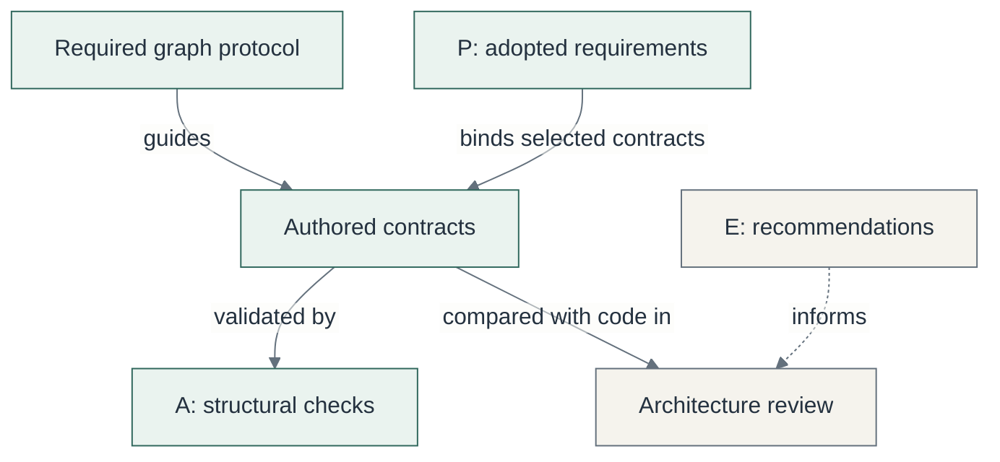
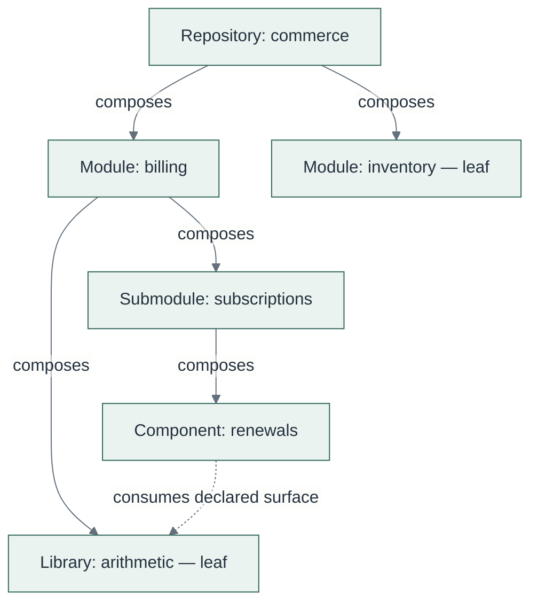
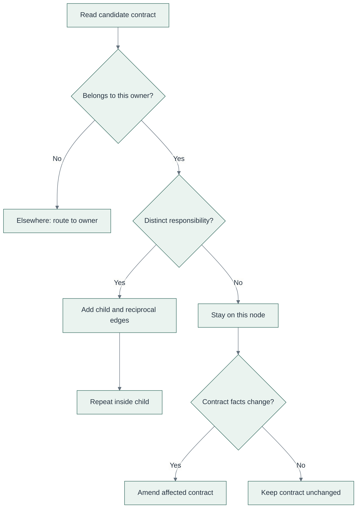
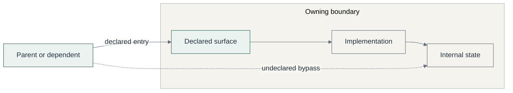
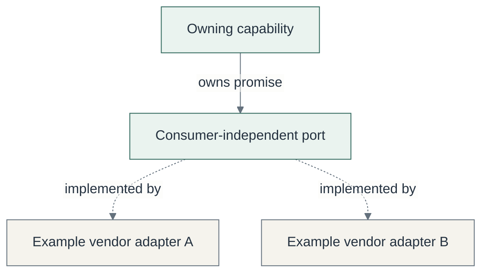

# Architecture considerations

**Contract Graph requires software to have explicit, recursively decomposed responsibilities,
with a truthful contract graph that lets an agent find where a change belongs.**

That is the framework's central opinion. The contract graph is the map used before reading
implementation. Its rules protect the usefulness of that map.

This guide describes the **current shipped defaults for 0.6.0**, including the recent catalog
review. It does not reconstruct every intention behind older versions of `architecture.yaml`.
The source of truth is [the architecture catalog](../src/cg/principles/architecture.yaml).

**Audience:** framework adopters and reviewers deciding what architecture a repository must preserve.

**Read this guide:** [Mandatory structure](#1-what-is-mandatory) ·
[Responsibilities](#2-organize-around-responsibilities) ·
[Placement](#3-every-change-has-a-placement-decision) ·
[Boundaries](#4-declare-how-a-boundary-is-used) ·
[A checks](#5-what-a01a16-actually-enforce) ·
[Repository choices](#6-which-architectural-choices-remain-yours) ·
[Adoption](#7-what-changes-after-installation) ·
[Review checklist](#8-a-short-review-checklist)

## 1. What is mandatory?

There are two kinds of architectural obligation, plus optional engineering advice:

| Kind | What you are agreeing to | How it is checked |
|---|---|---|
| **Graph-writing protocol** — `hierarchy` and `graph` | Place responsibilities correctly, declare their entry points and relationships, and keep the graph aligned with implementation. | Agents and reviewers apply the protocol. The verifier checks parts of its declared result; it does not prove every design decision. |
| **Global structural checks** — A01–A16 | Every governed boundary satisfies the registered checks for contract format, composition, references, surfaces, ownership declarations, and naming. | The installed verifier rejects measurable violations. |
| **Engineering advice** — E | Consider relevant practices and their trade-offs. | Reading E does not create required changes, acceptance criteria, or compliance failures. |
| **Product bindings** — P | Follow repository-authored product requirements where selected by contract rule context. | Enforcement mappings connect P to repository detectors; validating a mapping does not itself run the detector. |

**Mandatory does not mean fully machine-proven.** “Keep callers out of undeclared internals”
is a structural authoring obligation. Today, a passing graph check does not establish that
all source imports obey it.

**Figure 1 — Current authority model.** The [catalogs](../src/cg/principles/architecture.yaml)
separate required structure, adopted product rules, and advice. Arrows describe authority and
review relationships, not runtime calls.



Architecture, engineering, and product share a schema, **not authority**. Keeping the protocol
in `architecture.yaml` also prevents a workflow edit from accidentally removing the structural
instructions. The delivery sequence lives separately in the skills and repository workflow.

## 2. Organize around responsibilities

A boundary answers four questions:

1. What one responsibility does it own?
2. How does its parent use it?
3. Where can callers enter, and what may they rely on?
4. Which children or dependencies explain the next level down?

The repository decomposes into product or domain capabilities such as billing, inventory, or
identity. The shipped hierarchy does not use horizontal top-level modules such as controllers,
services, and repositories. Those implementation roles can exist inside a capability.

Each governed boundary has one canonical file:

```text
<unit>/.agents/cg/contract.yaml
```

The root contract is `.agents/cg/contract.yaml`. A child lives beneath its parent unit and both
contracts declare the relationship.

**Figure 2 — Illustrative ownership graph.** Commerce names are examples, not this repository's
modules. The nesting follows the [shipped hierarchy](../src/cg/principles/architecture.yaml).
Composition and dependency have different meanings.



Solid arrows show **composition**: a child helps fulfill its parent's responsibility.
The dotted arrow shows **dependency**: one boundary consumes another's declared promise.
These are different relationships. A boundary has one composition parent, while other nodes
can depend on it without becoming its parents.

### Allowed nesting

| Parent kind | Allowed child kinds |
|---|---|
| Repository | Module |
| Module | Submodule, component, library |
| Submodule | Submodule, component, library |
| Component | Component, library |
| Library | None |

Depth is not fixed. A module can be a leaf; another module can need several levels. A component
can decompose further. A library is a leaf in the shipped hierarchy.

**A folder, a file, size growth, or a second vendor is not sufficient reason to create a node.**
A new node needs a distinct responsibility and a coherent surface. Conversely, do not hide a
distinct responsibility inside an existing node simply because its files are already open.
When several packages form one boundary, name them and explain why they are inseparable.

## 3. Every change has a placement decision

Apply this reasoning recursively, starting from the contract that owns the relevant capability.
Finding a module is the start of routing; it is not proof that the module is the smallest unit.

**Figure 3 — Current placement decision.** This simplifies
[`graph.decide`](../src/cg/principles/architecture.yaml) into a reading order. Arrows show the
review decision, not application execution.



Use **add-child** when the new responsibility is part of how this parent fulfills its own.
Use **elsewhere** when it belongs to a different owner. Existing code may need restructuring
before those declarations can truthfully describe it.

| Example | Decision |
|---|---|
| Optimize invoice calculation while preserving its promise | Stay; no contract amendment if its facts remain true. |
| Add an invoice operation to the same coherent responsibility | Stay and amend the declared surface. A new operation alone does not require a child. |
| Introduce renewal scheduling as a distinct part of subscriptions | Add a child when it has its own responsibility and surface. |
| Add inventory reservation while editing billing | Route to inventory and declare the dependency if billing consumes it. |
| Add a second payment vendor | Review the adapter's responsibility. Separate implementation is recommended; a new contract is required only if it earns a node. |

Changed ownership, allowed or forbidden behavior, surface, invariants, verification, relationships,
or routes requires an affected contract amendment. The implementation and its map change together.

## 4. Declare how a boundary is used

Callers enter through the surface named by the contract. That surface explains the observable
promise; implementation details remain behind it unless deliberately part of the promise.

“Declared surface” does not necessarily mean an HTTP endpoint, a public class, or a customer UI.
A function, command, event, schema, service, or asynchronous interface may express the promise.
There is no requirement for one or two classes, synchronous completion, or a service wrapper.

**Figure 4 — Illustrative boundary access.** Solid arrows show intended access. The dashed arrow
shows an undeclared bypass requiring review under
[`graph.surface`](../src/cg/principles/architecture.yaml); it is not an observed defect in this repository.



For example, callers of billing can depend on a declared `createInvoice` operation. They should
not discover and mutate its private invoice cache. A storage library may intentionally expose
storage concepts when those concepts are its actual promise; the framework does not forbid all
technology-specific interfaces.

If access bypasses the surface, correct the caller, deliberately amend the promise, or change
placement. A bypass does not automatically mean “create another node.”

The parent owns the cross-child orchestration needed for its responsibility. Each child owns
its internal flow. Children do not coordinate one another's internals.

### Optional resources and consumer-specific behavior

The retained protocol uses a parent-owned port for an optional external resource or
consumer-specific implementation. A port is the promise the owning capability needs from that
implementation. An adapter supplies the vendor or consumer-specific behavior behind that promise.

**Figure 5 — Illustrative adapter relationship.** The
[adapter protocol](../src/cg/principles/architecture.yaml) separates the owned promise from its
implementations. These arrows show promise ownership and implementation, not composition edges
or request order.



Separate adapters are an E recommendation. **Contract decomposition still follows responsibility.**
Do not put a consumer-specific branch into a consumer-independent core when its existing promise
already supports the behavior. If the promise is insufficient, amend it with an owned,
consumer-independent concept and update affected consumers.

## 5. What A01–A16 actually enforce

Run `cg verify` to check the authored graph and installed structure. These are the current A checks:

| ID | Required declared fact | Important limit |
|---|---|---|
| A01 | Nodes use the canonical restricted YAML format and contract schema. | Valid YAML does not prove truthful content. |
| A02 | Each node is at the canonical path for its unit. | This does not discover every missing boundary in implementation. |
| A03 | Exactly one non-empty ownership entry per node. | One sentence can still conceal several responsibilities. |
| A04 | Parent/child kinds follow the permitted hierarchy. | Valid kinds do not establish good placement. |
| A05 | Leaf, composed, and unmapped states agree with declared children. | A leaf declaration does not prove that no implementation child was omitted. |
| A06 | Composition is one rooted, reciprocal, reachable, acyclic tree. | Checks the authored tree. |
| A07 | Each child unit is beneath its parent unit. | Does not prove an agent stays inside a write scope. |
| A08 | Dependency targets exist and are not self-references. | Does not discover undeclared code dependencies. |
| A09 | Declared dependencies contain no cycle. | Undeclared imports are outside this proof. |
| A10 | Non-repository nodes declare a surface. | Presence does not prove exported operations exist. |
| A11 | Declared surface paths exist within the unit. | Does not prove symbols, compatibility, or caller confinement. |
| A12 | Invariant/verification references agree; unverified invariants declare debt. | Does not run the commands or establish test adequacy. |
| A13 | A principles name registered detectors and their registered fixtures. | P enforcement mappings are separate. |
| A14 | Normalized ownership statements are unique. | Differently worded statements may still overlap. |
| A15 | Top-level module labels avoid reserved technical-layer names. | A permitted name does not prove capability decomposition. |
| A16 | Non-root labels avoid reserved miscellaneous names. | Renaming `utils` does not make its contents cohesive. |

A15 rejects the reserved controller, service, repository, and model labels, including their
listed plurals. A16 rejects `common`, `shared`, `utils`, `helpers`, `util`, and `helper`.
The checks examine the node ID, name, and unit basename. They do not ban using those words
in ordinary prose or as every internal filename.

Other installed checks also validate identity uniqueness, route targets, product references,
and prohibited references to transient plans. A passing verification result is evidence of
**declared graph consistency**, not a certificate of complete implementation correspondence.

## 6. Which architectural choices remain yours?

These are recommendations or product decisions, not universal A requirements:

- Classes versus functions, service facades, and a fixed number of entry types.
- A separate contract for every adapter or vendor.
- Constructor injection for every object or construction only at application bootstrap.
- One deployable, one physical database, or one physical writer process.
- Exactly two consumers before creating a reusable library.
- An integer version on every persisted record as the only compatibility strategy.
- A universal ban on configurable authorization policy or customer-initiated account removal.
- Confirmation before every external side effect regardless of existing authorization.
- One UI, tenancy model, billing model, or solo-maintainer operating model.

E offers advice about these decisions. Shipped phase defaults require reading E as context;
**reading a recommendation does not adopt it as a binding**. Retained repository phase policy
can choose different loading. P is the place for deliberately adopted product-specific bindings.

## 7. What changes after installation?

`cg init` installs opinionated defaults and refreshes architecture and engineering on upgrade,
showing the updates and backing up previous files. Product rules retain their content through
format migration. Contracts and enforcement retain their content apart from known legacy schema
identities; workflow and phase policy are preserved. Review backed-up A/E amendments before
reapplying them to the new release defaults.

Repository ownership does not make installed detector behavior editable through prose. Amendments
must remain within registered semantics. Changing YAML or removing an entry does not create a new
detector or prove that an existing verifier check has been disabled.

A generic practice becomes A only through a verifier-owning change that supplies all four:

1. A concrete effect on graph routing, ownership, boundaries, or structural truth.
2. One deterministic pass/fail measure.
3. A registered blocking detector.
4. A negative fixture proving that a violation fails.

That change assigns a permanent A ID and removes the overlapping E practice. Until then, an
important recommendation remains advice, an explicit repository requirement, or a proposed promotion.

## 8. A short review checklist

Before accepting a structural change, ask:

- Can a new session route from the root to the responsible unit without searching unrelated code?
- Does each affected node explain one coherent responsibility and how its parent uses it?
- Are entry points and cross-boundary dependencies explicit?
- Does composition reflect responsibility rather than directory count or technology count?
- Have changed promises and relationships been amended alongside the implementation?
- Which guarantees were verified mechanically, and which still depend on review or missing detectors?
- Are any E preferences being treated as requirements without deliberate adoption?

For field details, read [Contracts](contracts.md). For stage behavior, read [Lifecycle](lifecycle.md).
For the rationale behind the recent changes, read the
[architecture and engineering review](reviews/architecture-engineering-rules.md).
