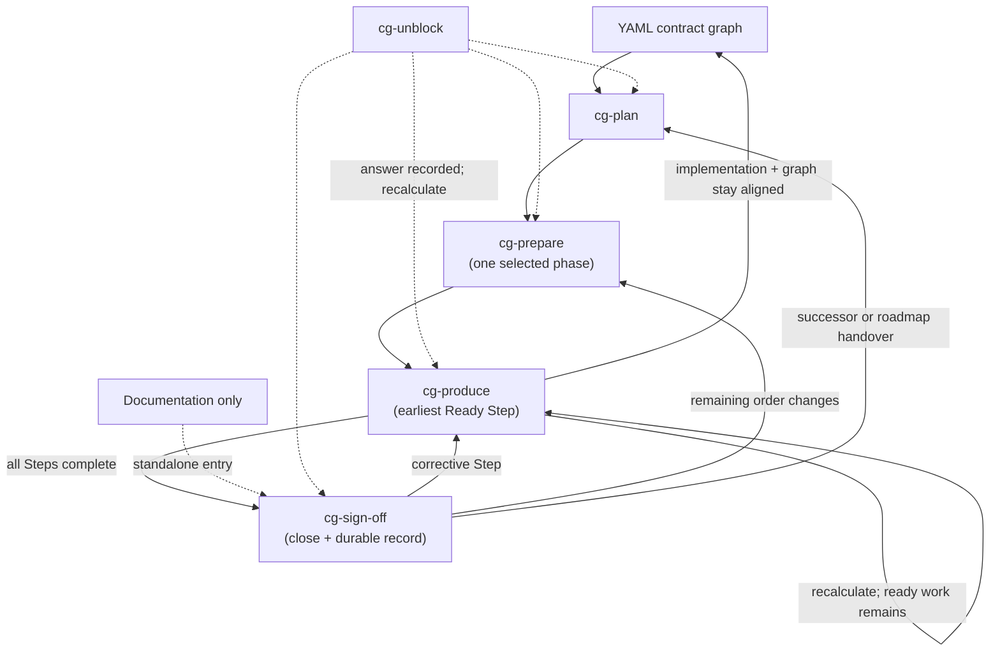

# Lifecycle

Seven skills, one `cg-` namespace: four lifecycle stages and three supporting skills. They specify
responsibilities and evidence, not a particular coding agent — a repository supplies its own
contract hierarchy, decision log, verification command, and document locations.

The lifecycle is the maintenance loop for the YAML contract graph. Its primary outcome is not only
working code; it is working code whose current structure is still traversable from the repository
contract. Every pass routes through the graph, changes the smallest responsible boundary, updates
the affected graph facts, verifies both, and leaves that improved context for the next pass.

The structural binding catalog governs this loop. Its `A` rules protect responsibility,
hierarchy, graph closure, surfaces, dependencies, and verification reciprocity on every pass.
Repository-owned `P` rules bind only the contracts that list them. `E` engineering practices
remain available for judgement, but proximity to
the structural core does not make advice enforceable.

## Authority in every lifecycle pass

Every stage keeps the same precedence and does not infer authority from forceful wording:

1. Load `.agents/cg/principles/architecture.yaml`. Apply its `hierarchy.kinds` and the `graph` walk below
   before changing a node. Its `A` rules apply globally and `cg verify` blocks on their
   measurable violations.
2. Resolve inherited and local `P` IDs from the selected contract path; these are the adopting
   repository's scoped product bindings.
3. Apply the repository's specifications, constitution, and accepted decisions without replacing
   Contract Graph's structural layer.
4. Consult `E` engineering entries when judgement remains.
   They may influence a choice, but an `E` disagreement is not a compliance failure.

Promotion is a structural change, not a prose edit at phase close. `cg-sign-off` or `cg-unblock`
may classify an `E` practice as a candidate. In the codebase that owns the verifier, `cg-produce`
must deliver its permanent `A` ID, deterministic measure, registered blocking detector, negative
fixture, and removal of the `E` copy together; `cg-sign-off` then proves that complete change. An
adopting repository whose installed verifier does not recognize the proposed detector records the
candidate or proposes it upstream instead of claiming a new A locally. A product-specific rule
follows the separate `P` path: guideline text, enforcement-map row, detector, and affected
contract IDs land together.

## The graph walk

`.agents/cg/principles/architecture.yaml` `graph` is what writes and extends the graph. Workflow
changes must not replace this section. The schema requires every key so an installed catalog cannot
drop a step. JSON Schema does not execute the order; the YAML order is the walk an agent applies at
every candidate.

Stay, add-child, and elsewhere remain the only three outcomes. The keys before `decide` say
whether a unit deserves a node and how it is entered. The keys after it say how children relate,
when to stop, what is not a node, and the vendor exception that forbids stay.

| Order | Key | Role |
|---|---|---|
| 1 | `node` | Definition. One owned responsibility, one hierarchy kind, one `contract.yaml`. |
| 2 | `recurse` | Walk. Apply the rest at every candidate. A module listed by `cg modules` is not a leaf until `selfSufficient` and `stop` have been applied inside it. |
| 3 | `selfSufficient` | Fitness. Named function, small inbound surface, published outbound ports, own change reasons. |
| 4 | `surface` | Declared entry and encapsulation. Enter only through the contract surface. The first way to declare it is a **service**: named operations that take parameters, do the work, and return the completed result; `contract.yaml` `surface` lists those services. Construction stays behind the call. Internals, algorithms, persistence, framework types, and vendor types stay behind it. A new entry or a bypass is not stay. |
| 5 | `decide` | Fork. **stay**, **add-child**, or **elsewhere**. |
| 6 | `compose` | Children. Parent owns orchestration; children decompose `owns`; no child-to-child internals. |
| 7 | `stop` | Quit splitting. Not per file; depth is mixed and uncapped; inseparable packages need a named rationale. |
| 8 | `forbid` | Anti-patterns. A new folder, file, or dependency is not a node; neither is `utils` or “it was already in the edit set”. |
| 9 | `adapters` | Vendor split of `surface.encapsulate`. One parent-owned port; each optional store, cloud, or transport is its own child. A second vendor client is add-child, not stay. |

`surface` sits before `decide` because encapsulation behind the contract is core, not an exception.
`graph.surface.service` is the first declaration of that encapsulation: a list of services the YAML
node points at, not constructor ports on the caller. Unmanaged scatter — many functions across
files with no small inbound surface — becomes a small set of those services as a corrective Step,
not a node per file. `adapters` is last because it is not a fourth
decide id. It overrides `forbid` for optional vendors.
Mixed Mongo and PostgreSQL clients, an undeclared entry, or internals on the surface are a
corrective Step, not silent stay. That is a protocol skills apply. It is not an `A` detector and
does not scan imports; `cg verify` still only proves declared paths exist (A10, A11).

Warmup, prepare, and produce walk this sequence before they keep work on the open node. An
adopting repository whose installed catalog is missing a key is stale; copy the packaged binding.
`cg init` will not overwrite the installed catalog.

The stage sequence is `cg-plan` → `cg-prepare` → `cg-produce` → `cg-sign-off`. Do not infer that
sequence from a skill picker: editors commonly rank skills by usage rather than filename. Every
stage ends with a machine-readable `Next action` route instead. The three supporting skills are
outside the sequence: `cg-unblock` is entered from any stage, `cg-auto-run` follows stage routes
under explicit authority, and `cg-warmup` is run once at brownfield adoption.

| Skill | Responsibility |
|---|---|
| `cg-plan` | Traverse the current graph, convert a broad outcome into an ordered phase roadmap, and identify the boundaries likely to change. Owns programme shape, dependencies, phase acceptance, risk, and status — not execution allocation. |
| `cg-prepare` | Select one phase and convert it into one prioritized queue of contract-complete Steps. Each Step names its owning boundary, expected graph changes, verification, explicit dependencies, blockers, and state in a single execution branch or worktree. |
| `cg-produce` | Run the earliest ready Step; deliver implementation, tests, YAML contract updates, and detectors as one independently valid structural change; recalculate the queue; continue serially. |
| `cg-sign-off` | Verify every prepared Step completed through a dependency-safe history and that the resulting graph still describes and routes through the implemented system; drive current-phase defects through corrective Steps; harvest decisions; close only on a green gate. Owns the durable record too — design records, product and operator guidance, and diagrams — and is entered standalone when only documentation is needed. Never repairs contract correctness as detached cleanup. |
| `cg-unblock` | Govern forks across the lifecycle: apply contract-backed or reversible defaults, record assumptions, log blocked Steps, keep independent work moving. |
| `cg-auto-run` | **Opt-in.** Dispatch one stage at a time, follow its `Next action` only while measured state advances within the granted authority, and stop on blockers, `cg-unblock`, failed gates, or the dispatch budget. It performs no lifecycle stage itself. |
| `cg-warmup` | **Once, at adoption.** Discover an existing repository's real boundaries, write and connect their YAML contracts, add contract-owned routes, verify every applicable structural binding, and harvest product bindings or non-binding engineering guidelines. Raises what it cannot settle as `DU-NN` entries in the decision log rather than asking in chat. Never scores, never edits behaviour. |



## Why plan and prepare are separate

They answer different questions. *What sequence delivers the outcome?* and *how does this selected
phase become a safe sequence of executable Steps?* Restructuring stays inside preparation and
execution because its source, destination, tests, dependencies, contracts, and residue must be
allocated atomically.

## The queue is continuous and sequential

One phase branch or worktree, one Step in progress, no per-Step branches, no merge or rebase
between Steps. Preparation assigns stable priority numbers and **explicit** dependencies rather
than treating every earlier number as an implicit one.

| State | Meaning |
|---|---|
| `Waiting` | at least one declared dependency is incomplete |
| `Ready` | dependencies complete, blockers clear, verified phase state matches |
| `Blocked` | an exact decision or external prerequisite prevents execution |
| `In progress` | the one Step currently executing |
| `Complete` | the Step gate passed and its handoff is recorded |

Execution always selects the lowest-numbered `Ready` Step, then recalculates and continues without
interrupting the owner while ready work remains. A blocked Step stays visible and incomplete; a
later Step runs only when it has no dependency or path collision with the blocked work.

For Steps `1`–`4` where `2` is blocked, `3` depends only on `1`, and `4` depends on `2`, the valid
history is `1 → 3 → 2 → 4`. No dependency was reordered: `3` never consumed `2`, and `4` waited.

This is continuous serial execution, not parallel execution. It avoids converting coordination
ambiguity into integration ambiguity while preventing one localized decision from idling unrelated
work.

## Queue state is on disk

Each programme keeps `roadmap.md` and one `<phase>_detailed_preparation.md` queue under
`docs/plans/<programme>/`. `cg next` selects the owning stage from the queue's `## Step <n>`
sections; `cg residue` reports planning artifacts no roadmap claims. See the root README for the
complete layout.

## Stage boundaries are explicit

A stage completes its own responsibility and returns its `Next action`; it does not invoke the
next stage merely because the route is obvious. `cg-auto-run` is the one exception, because its
invocation carries an authority level, a dispatch budget, and an on-disk ledger.

For Claude Code, the optional gate compares a requested skill with `cg next --for <skill>`.

### Enabling the Claude Code gate

`cg init` ships `.agents/hooks/cg-gate.mjs` but does not edit user-owned hook settings. Merge this
registration into `.claude/settings.json`:

```json
{
  "hooks": {
    "PreToolUse": [{
      "matcher": "Skill",
      "hooks": [{ "type": "command", "command": "node \"$CLAUDE_PROJECT_DIR/.agents/hooks/cg-gate.mjs\"" }]
    }],
    "UserPromptSubmit": [{
      "hooks": [{ "type": "command", "command": "node \"$CLAUDE_PROJECT_DIR/.agents/hooks/cg-gate.mjs\"" }]
    }]
  }
}
```

The hook resolves `node_modules/.bin/cg`, then `cg` on `PATH`, or `CG_BIN`. Resolution failures
allow the dispatch, so confirm `cg --version` in the hook environment before relying on it.

## Unattended traversal is bounded

`cg-auto-run` is opt-in. It defaults to fully planned roadmap authority, checkpoints before every
dispatch, and stops on blockers, `cg-unblock`, failed gates, or its twenty-four-dispatch budget.
The skill itself defines the narrower `queue` and `phase` authorities and the wider `programme`
authority; the README gives the user-facing summary.

## Contract updates belong to execution

A prepared Step that changes behavior or structure owns the corresponding implementation, YAML
contract nodes, edges, surfaces, routes, invariants, verification, and detectors. Those changes are
one engineering unit—not documentation deferred to completion. Later Steps may edit the same file
only through an explicit dependency on the earlier verified handoff. This preserves the central
property: **the one executable branch stays truthful against its graph after every Step.**

The graph impact may be empty, but it must be assessed. A purely internal implementation change can
leave the contract untouched when responsibility, public surface, relationships, routes, and
invariants are unchanged. A structural change is incomplete until those graph facts change with it.

The loop closes in this order:

1. resolve the responsible contract, global A principles, scoped P guidelines, and repository
   specification or constitution;
2. change only the implementation and graph surface allocated to the Step;
3. run the boundary's declared verification;
4. run graph verification for node, edge, reachability, and reference integrity; and
5. hand off a branch in which the graph describes the code that now exists.

## Completion is a repair loop, not a review

`cg-sign-off` directly fixes only integration composition and emergent tests. A behaviour-,
boundary-, invariant-, or contract-affecting defect re-enters `cg-produce` as a corrective Step so
its implementation, tests, contract, and detector remain one independently valid change.

A finding may leave a green phase only when it is genuinely outside that phase. A failing phase gate
stays Incomplete or Blocked and is never archived as Complete.

## Every response ends with one route

```markdown
## Next action — <measured lifecycle status>
- **User action:** <one concrete action>
- **Next input:** <$cg-skill | None — terminal reason> — <artifact>
- **Blocked by:** <exact blocker>   <!-- third line only when the status does not advance -->
```

Two body lines on an advancing status, three when something stops. The status rides the heading so
a blocked result is distinguishable at a glance. The routed skill leads `Next input` as a `$cg-`
token so the next hop stays mechanically extractable rather than buried in prose.

`Blocked by` appears **if and only if** the status does not advance. On a green route it is omitted:
a precondition already satisfied is not information, and a mandatory field with nothing to say gets
padded with restated status. Its presence is also the single stop signal any auto-advance adapter
reads — a block carrying `Blocked by` is never followed automatically.

The user is never asked to infer a route from several alternatives. This makes a skill result
executable by a cold-start human or agent with no chat history.
