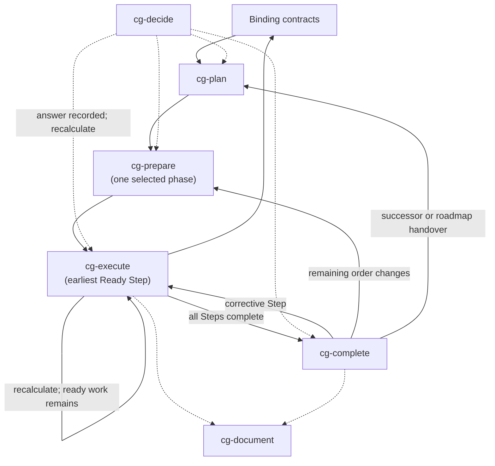

# Lifecycle

Six skills, one `cg-` namespace. They specify responsibilities and evidence, not a particular
coding agent — a repository supplies its own contract hierarchy, decision log, verification
command, and document locations.

| Skill | Responsibility |
|---|---|
| `cg-plan` | Convert a broad outcome into an ordered phase roadmap. Owns programme shape, dependencies, phase acceptance, risk, and status — not execution allocation. |
| `cg-prepare` | Select one phase and convert it into one prioritized queue of contract-complete Steps with explicit dependencies, blockers, and state, in a single execution branch or worktree. |
| `cg-execute` | Run the earliest ready Step; deliver implementation, tests, contract updates, and detectors as one independently valid change; recalculate the queue; continue serially. |
| `cg-decide` | Govern forks across the lifecycle: apply contract-backed or reversible defaults, record assumptions, log blocked Steps, keep independent work moving. |
| `cg-complete` | Verify every prepared Step completed through a dependency-safe history; drive current-phase defects through corrective Steps; harvest decisions and knowledge; close only on a green gate. |
| `cg-document` | Maintain durable design records, product and operator guidance, and diagrams. Never owns contract correctness. |



## Why plan and prepare are separate

They answer different questions. *What sequence delivers the outcome?* and *how does this selected
phase become a safe sequence of executable Steps?* Restructuring stays inside preparation and
execution because its source, destination, tests, dependencies, contracts, and residue must be
allocated atomically.

## The queue is continuous and sequential

One phase branch or worktree, one Step in progress, no per-Step branches, no merge or rebase
between Steps. Preparation assigns stable priority numbers and **explicit** dependencies rather
than treating every earlier number as an implicit one.

| State | Meaning |
|---|---|
| `Waiting` | at least one declared dependency is incomplete |
| `Ready` | dependencies complete, blockers clear, verified phase state matches |
| `Blocked` | an exact decision or external prerequisite prevents execution |
| `In progress` | the one Step currently executing |
| `Complete` | the Step gate passed and its handoff is recorded |

Execution always selects the lowest-numbered `Ready` Step, then recalculates and continues without
interrupting the owner while ready work remains. A blocked Step stays visible and incomplete; a
later Step runs only when it has no dependency or path collision with the blocked work.

For Steps `1`–`4` where `2` is blocked, `3` depends only on `1`, and `4` depends on `2`, the valid
history is `1 → 3 → 2 → 4`. No dependency was reordered: `3` never consumed `2`, and `4` waited.

This is continuous serial execution, not parallel execution. It avoids converting coordination
ambiguity into integration ambiguity while preventing one localized decision from idling unrelated
work.

## Contract updates belong to execution

A prepared Step that changes behaviour owns its governing contract and detector. Not documentation,
not completion. Later Steps may edit the same file only through an explicit dependency on the
earlier verified handoff. This preserves the central property: **the one executable branch stays
truthful against its contracts after every Step.**

## Completion is a repair loop, not a review

`cg-complete` directly fixes only integration composition and emergent tests. A behaviour-,
boundary-, invariant-, or contract-affecting defect re-enters `cg-execute` as a corrective Step so
its implementation, tests, contract, and detector remain one independently valid change.

A finding may leave a green phase only when it is genuinely outside that phase. A failing phase gate
stays Incomplete or Blocked and is never archived as Complete.

## Every response ends with one route

```markdown
## Next action — <measured lifecycle status>
- **User action:** <one concrete action>
- **Next input:** <$cg-skill | None — terminal reason> — <artifact>
- **Blocked by:** <exact blocker>   <!-- third line only when the status does not advance -->
```

Two body lines on an advancing status, three when something stops. The status rides the heading so
a blocked result is distinguishable at a glance. The routed skill leads `Next input` as a `$cg-`
token so the next hop stays mechanically extractable rather than buried in prose.

`Blocked by` appears **if and only if** the status does not advance. On a green route it is omitted:
a precondition already satisfied is not information, and a mandatory field with nothing to say gets
padded with restated status. Its presence is also the single stop signal any auto-advance adapter
reads — a block carrying `Blocked by` is never followed automatically.

The user is never asked to infer a route from several alternatives. This makes a skill result
executable by a cold-start human or agent with no chat history.
