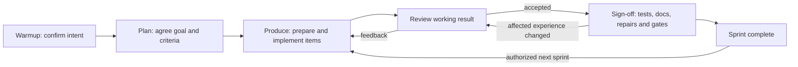

# Lifecycle

The stages you run after `cg init`, and the structural walk they share when a node is kept,
split, or moved.

How a programme is split into phases and steps, and what is supposed to remain after a plan is
deleted, is [workflow](workflow.md). This page is what each stage is *for*, and how the graph is
decided.

The `/cg-*` skills and the installed `.agents/cg/workflow.md` are the turn-by-turn procedure an
agent follows. This directory is not that procedure.

## What binds a change

Three families stay distinct on every pass. They are one kind of thing — principles — with
different binding:

| Family | What it is | What happens if you disagree |
|---|---|---|
| `A` | Structural principles in `.agents/cg/principles/architecture.yaml` (`binding: global`) | `cg verify` fails on a measurable violation. The same file's `hierarchy.kinds` and `graph` walk decide whether a unit is a node. |
| `P` | Product principles the adopting repository authored (`binding: scoped`) | They bind only the contracts that list them. |
| `E` | Engineering principles in `.agents/cg/guidelines/engineering.yaml` (`binding: advisory`) | SHOULD hold; not a compliance failure, and not a reason to invent a node the `graph` walk would not write. Consult relevant entries for engineering decisions. |

A new generic `A` rule is a change in the codebase that owns the verifier: a permanent ID, a
deterministic measure, a blocking detector, a fail-on-demand fixture, and removal of the overlapping
`E` copy, together. An adopting repository whose installed verifier does not recognize a proposed
detector records a candidate or proposes it upstream. A product-specific rule follows the `P`
path: guideline text, enforcement row, detector, and the contracts that list it.

## The graph walk

`.agents/cg/principles/architecture.yaml` `graph` is what writes and extends the graph. The schema
requires every key so an installed catalog cannot drop a step. JSON Schema does not execute the
order; the YAML order is the walk used whenever a candidate is kept, split, or moved.

Stay, add-child, and elsewhere remain the only three outcomes. The keys before `decide` say
whether a unit deserves a node and how it is entered. The keys after it say how children relate,
when to stop, what is not a node, and how the same decision applies to adapters.

| Order | Key | Role |
|---|---|---|
| 1 | `node` | Definition. One owned responsibility, one hierarchy kind, one `contract.yaml`. |
| 2 | `recurse` | Walk. Apply the rest at every candidate. A module listed by `cg modules` is not a leaf until `selfSufficient` and `stop` have been applied inside it. |
| 3 | `selfSufficient` | Fitness. Named function, small inbound surface, published outbound ports, own change reasons. |
| 4 | `surface` | Declare entry paths and observable promises. Services are one option; functions, events, and asynchronous interfaces are valid. Keep undeclared implementation details internal. Amend the surface when its promise changes. |
| 5 | `decide` | Fork. **stay**, **add-child**, or **elsewhere**. |
| 6 | `compose` | Children. Parent owns orchestration; children decompose `owns`; no child-to-child internals. |
| 7 | `stop` | Quit splitting. Not per file; depth is mixed and uncapped; inseparable packages need a named rationale. |
| 8 | `forbid` | Anti-patterns. A new folder, file, or dependency is not a node; neither is `utils` or “it was already in the edit set”. |
| 9 | `adapters` | Apply responsibility and self-sufficiency to each adapter. A distinct owned responsibility earns a child; vendor count alone does not. Keep consumer-specific behavior outside a consumer-independent core while its existing promise suffices. |

`surface` sits before `decide` because encapsulation behind the contract is core, not an exception.
`graph.surface.service` describes service entry without requiring a class or facade. Review
scattered entry points against ownership and the declared promise before proposing a rewrite.
`adapters` applies the same node decision to a vendor or consumer-specific implementation;
it does not override that decision based on vendor count. Consumer-specific behavior does not
modify or branch the core while its consumer-independent promise already suffices.

That walk is a protocol the stages apply. It is not an `A` detector and does not scan imports;
A10 checks surface presence and A11 checks paths; neither proves exported symbols or caller confinement.

Warmup, plan, and produce walk this sequence before they keep work on the open node. An
adopting repository whose installed catalog is missing a key is stale. Refresh it with `cg init`, which previews replacement and retains backups of A/E catalogs; preserve repository-owned product and workflow choices.

## The lifecycle skills

The 0.7.0 delivery path is plan → produce → sign-off, with review and repair loops. Preparation belongs partly to planning readiness and partly to production. Automatic continuation is part of an authorised sprint-completion request.

| Skill | Responsibility |
|---|---|
| `cg-warmup` | Confirm project intent and establish or reseed the truthful context graph. |
| `cg-plan` | Agree outcomes, acceptance and scope; assess baseline, boundaries, dependencies, likely approach and verification before production. |
| `cg-produce` | Ask for batch or per-item review, prepare incrementally, implement ready items, preserve blocked work and recover progress. Report each item's Code/Test/Docs status and next action, or None when the requested work is complete. |
| `cg-sign-off` | Finish deferred tests and useful docs, verify accepted outcomes, route implementation repairs through produce and close with passing evidence and remove obsolete transient files after preserving durable knowledge. |
| `cg-unblock` | Resolve consequential decisions, record actual scoped answers and resume eligible work. |
| `cg-prototype` | Explore a working experience through feedback and explicit acceptance, then finish through sign-off. |

### New sprint delivery

An agreed full-completion request carries this loop through its remaining work without repeated stage prompts. Acceptance of the working result is still explicit, and one-sprint authority does not extend to another sprint. Automatic continuation does not mean parallel execution or permission to merge and publish.

### Exploratory delivery

cg-prototype supplies a provisional implementation and accepted experience when the outcome needs exploration. Both loops meet at the same accepted cg delivery handoff. The common cg-sign-off procedure then completes remaining tests/docs and verification, using cg-produce for implementation repairs and their preparation. Accepted code is retained; another plan is needed only for a genuinely changed goal. There is no separate preparation or auto-run stage.

## How a phase queue works

One phase branch or worktree, one step in progress, no per-step branches, no merge or rebase
between steps. Preparation assigns stable priority numbers and **explicit** dependencies rather
than treating every earlier number as an implicit one.

| State | Meaning |
|---|---|
| `Waiting` | at least one declared dependency is incomplete |
| `Ready` | dependencies complete, blockers clear, verified phase state matches |
| `Blocked` | an exact decision or external prerequisite prevents execution |
| `In progress` | the one step currently executing |
| `Complete` | the step gate passed and its handoff is recorded |

Execution always selects the lowest-numbered `Ready` step, then continues while ready work
remains. A blocked step stays visible and incomplete; a later step runs only when it has no
dependency or path collision with the blocked work.

For steps `1`–`4` where `2` is blocked, `3` depends only on `1`, and `4` depends on `2`, the valid
history is `1 → 3 → 2 → 4`. No dependency was reordered: `3` never consumed `2`, and `4` waited.

This is continuous serial execution, not parallel execution. It avoids converting coordination
ambiguity into integration ambiguity while preventing one localized decision from idling unrelated
work.

## Where the files live

Each programme keeps `roadmap.md` under `docs/plans/<programme>/` by default. Production adds a `<phase>_detailed_preparation.md` queue only when finishing or repairs need explicit Step dependencies; ordinary sprint items keep short preparation in the roadmap. `cg init --docs` records a different root in
`.agents/cg/profile.json`; `cg residue` prints the plans directory that is actually in use.

`cg status --programme <slug>` reads the current queue and delivery record and shows remaining
Steps, exact file locations, recorded blockers, recovery action, and residue owners. It creates no
new status document. Older repair reports can explain history but do not override those records.

`cg residue --programme <slug>` checks selected and shared/unassigned files while listing other
programmes separately. An unreferenced file may be useful evidence awaiting a consumer link.
The unfiltered command still checks the whole repository. A scoped result does not replace a
repository-wide gate required by policy; coordinate other owners before final closure.

Repository-wide residue belongs at phase closure, not as a prerequisite for an individual Step.
`cg next` reports `repair-required` for direct global residue commands in fenced shell `Done when`
blocks. Preparation corrects their placement while retaining the final obligation. This detector
does not interpret arbitrary shell wrappers or prose prerequisites. Preparation can also repair
unreadable queue headers; production and closure remain gated until the queue is valid.

## Contract updates belong with the change

A prepared step that changes behavior or structure owns the corresponding implementation, YAML
contract nodes, edges, surfaces, routes, invariants, verification, and detectors. Those changes
are one engineering unit — not documentation deferred to completion. Later steps may edit the same
file only through an explicit dependency on the earlier verified handoff. This preserves the
central property: **the one executable branch stays truthful against its graph after every step.**

The graph impact may be empty, but it must be assessed. A purely internal implementation change can
leave the contract untouched when responsibility, public surface, relationships, routes, and
invariants are unchanged. A structural change is incomplete until those graph facts change with it.

## Closing a phase is a repair loop, not a review

`cg-sign-off` completes deferred tests and useful documentation, then verifies integration and final evidence. A behaviour-,
boundary-, invariant-, or contract-affecting defect re-enters produce as a corrective step so its
implementation, tests, contract, and detector remain one independently valid change.

A finding may leave a green phase only when it is genuinely outside that phase. A failing phase
gate stays Incomplete or Blocked and retains its recovery records. Successful closure also updates durable documentation, approved intent and YAML, then removes obsolete plans and progress files under the [workflow cleanup rules](workflow.md#keeping-documentation-small).

## Related

- [Workflow](workflow.md) — how an outcome becomes phases, steps, and a lasting graph.
- [Upgrade](upgrade.md) — Install 0.7.0 through `cg init`, preserving repository choices.
- [Contracts](contracts.md) — node shape and what verification proves today.
- [Vision](vision.md) — why the graph exists.
