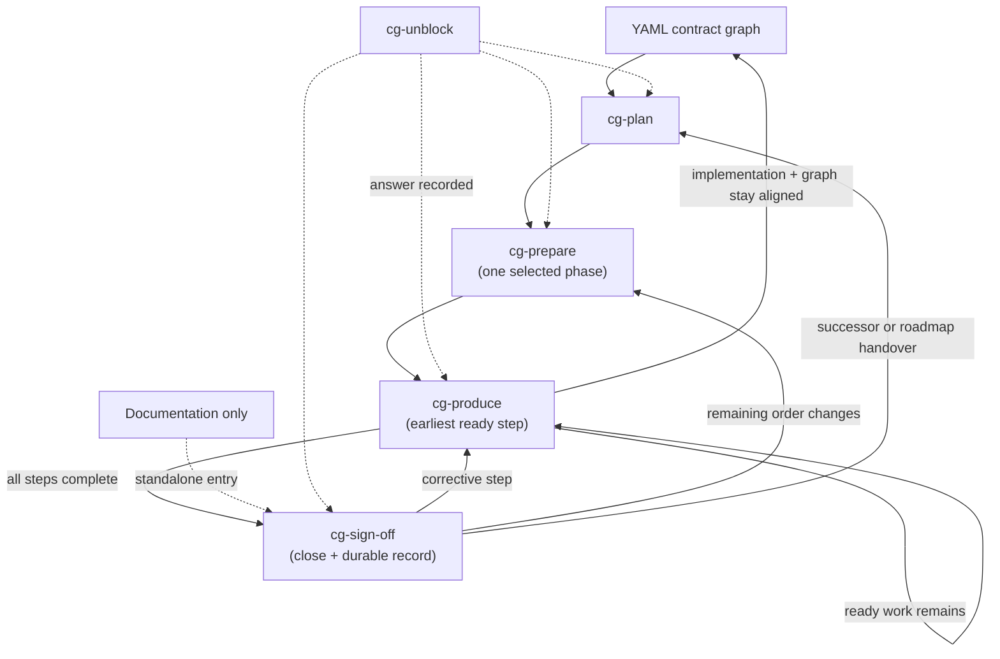

# Lifecycle

The stages you run after `cg init`, and the structural walk they share when a node is kept,
split, or moved.

How a programme is split into phases and steps, and what is supposed to remain after a plan is
deleted, is [workflow](workflow.md). This page is what each stage is *for*, and how the graph is
decided.

The `/cg-*` skills and the installed `.agents/cg/workflow.md` are the turn-by-turn procedure an
agent follows. This directory is not that procedure.

## What binds a change

Three families stay distinct on every pass:

| Family | What it is | What happens if you disagree |
|---|---|---|
| `A` | Structural bindings in `.agents/cg/principles/architecture.yaml` | `cg verify` fails on a measurable violation. The same file's `hierarchy.kinds` and `graph` walk decide whether a unit is a node. |
| `P` | Product rules the adopting repository authored | They bind only the contracts that list them. |
| `E` | Engineering guidelines in `.agents/cg/guidelines/engineering.yaml` | Useful judgement. Not a compliance failure, and not a reason to invent a node the `graph` walk would not write. |

A new generic `A` rule is a change in the codebase that owns the verifier: a permanent ID, a
deterministic measure, a blocking detector, a fail-on-demand fixture, and removal of the overlapping
`E` copy, together. An adopting repository whose installed verifier does not recognize a proposed
detector records a candidate or proposes it upstream. A product-specific rule follows the `P`
path: guideline text, enforcement row, detector, and the contracts that list it.

## The graph walk

`.agents/cg/principles/architecture.yaml` `graph` is what writes and extends the graph. The schema
requires every key so an installed catalog cannot drop a step. JSON Schema does not execute the
order; the YAML order is the walk used whenever a candidate is kept, split, or moved.

Stay, add-child, and elsewhere remain the only three outcomes. The keys before `decide` say
whether a unit deserves a node and how it is entered. The keys after it say how children relate,
when to stop, what is not a node, and the vendor exception that forbids stay.

| Order | Key | Role |
|---|---|---|
| 1 | `node` | Definition. One owned responsibility, one hierarchy kind, one `contract.yaml`. |
| 2 | `recurse` | Walk. Apply the rest at every candidate. A module listed by `cg modules` is not a leaf until `selfSufficient` and `stop` have been applied inside it. |
| 3 | `selfSufficient` | Fitness. Named function, small inbound surface, published outbound ports, own change reasons. |
| 4 | `surface` | Declared entry and encapsulation. Enter only through the contract surface. The first way to declare it is a **service**: named operations that take parameters, do the work, and return the completed result; `contract.yaml` `surface` lists those services. Construction stays behind the call. Internals, algorithms, persistence, framework types, vendor types, and a consumer's product-specific workflow stay behind it. A new entry, a bypass, or a consumer-specific branch of a generic flow is not stay. |
| 5 | `decide` | Fork. **stay**, **add-child**, or **elsewhere**. |
| 6 | `compose` | Children. Parent owns orchestration; children decompose `owns`; no child-to-child internals. |
| 7 | `stop` | Quit splitting. Not per file; depth is mixed and uncapped; inseparable packages need a named rationale. |
| 8 | `forbid` | Anti-patterns. A new folder, file, or dependency is not a node; neither is `utils` or “it was already in the edit set”. |
| 9 | `adapters` | Split of `surface.encapsulate` into child options. One parent-owned port; each optional store, cloud, transport, or consumer-specific implementation is its own child. Adding a consumer does not modify or branch the core while the port can express the required product-neutral promise. A second vendor client is add-child, not stay. |

`surface` sits before `decide` because encapsulation behind the contract is core, not an exception.
`graph.surface.service` is the first declaration of that encapsulation: a list of services the YAML
node points at, not constructor ports on the caller. Unmanaged scatter — many functions across
files with no small inbound surface — becomes a small set of those services as a later step, not a
node per file. `adapters` is last because it is not a fourth decide id. It overrides `forbid` for
optional vendors and consumer-specific implementations. Mixed Mongo and PostgreSQL clients,
a consumer-specific branch in a generic flow, an undeclared entry, or internals on the
surface are a later step, not silent stay.

That walk is a protocol the stages apply. It is not an `A` detector and does not scan imports;
`cg verify` still only proves declared paths exist (A10, A11).

Warmup, prepare, and produce walk this sequence before they keep work on the open node. An
adopting repository whose installed catalog is missing a key is stale; copy the packaged binding.
`cg init` will not overwrite the installed catalog.

## The seven stages

The delivery sequence is plan → prepare → produce → sign-off. Warmup runs at adoption before
that sequence, and again as an additive reseed after a package upgrade when the graph already
exists. Unblock is entered from any stage when a choice is expensive or protected. Auto-run
is optional and follows an already-planned roadmap; it does not invent the plan, and it never
dispatches warmup.

| Skill | Responsibility |
|---|---|
| `cg-plan` | Traverse the current graph, convert a broad outcome into an ordered phase roadmap, and identify the boundaries likely to change. Owns programme shape, dependencies, phase acceptance, risk, and status — not which files move. |
| `cg-prepare` | Select one phase and convert it into one prioritized queue of contract-complete steps. Each step names its owning boundary, expected graph changes, verification, explicit dependencies, blockers, and state in a single execution branch or worktree. |
| `cg-produce` | Run the earliest ready step; deliver implementation, tests, YAML contract updates, and detectors as one independently valid structural change; continue through ready work. |
| `cg-sign-off` | Verify every prepared step completed and that the resulting graph still describes the implemented system; drive current-phase defects through corrective steps; harvest decisions; close only on a green gate. Also owns the durable record — design records, product and operator guidance, and diagrams — and is entered standalone when only documentation is needed. Never repairs contract correctness as detached cleanup. |
| `cg-unblock` | Govern forks across the lifecycle: apply contract-backed or reversible defaults, record assumptions, log blocked steps, keep independent work moving. |
| `cg-auto-run` | **Opt-in.** Follow already-named next stages while measured state advances, then stop on blockers, owner decisions, or failed gates. At `roadmap` authority it continues through remaining planned phases; it does not stop after a phase or dispatch count. It performs no lifecycle stage itself. |
| `cg-warmup` | **Adoption, then additive reseed.** Discover an existing repository's real boundaries, write and connect their YAML contracts, add contract-owned routes, verify every applicable structural binding, and harvest product bindings or non-binding engineering guidelines. On a governed graph, reseed adds missing children, P rows, and route targets without rewriting existing purpose or P IDs. Raises what it cannot settle in the decision log rather than asking in chat. Never scores, never edits behaviour. |

Each stage finishes its own job and names what should happen next. It does not start the next
stage on its own. Auto-run is the exception, because you grant it authority to follow those names.

## Why plan and prepare are separate

They answer different questions. *What sequence delivers the outcome?* and *how does this selected
phase become a safe sequence of executable steps?* Restructuring stays inside preparation and
execution because its source, destination, tests, dependencies, contracts, and leftover files must
be allocated together.

## How a phase queue works

One phase branch or worktree, one step in progress, no per-step branches, no merge or rebase
between steps. Preparation assigns stable priority numbers and **explicit** dependencies rather
than treating every earlier number as an implicit one.

| State | Meaning |
|---|---|
| `Waiting` | at least one declared dependency is incomplete |
| `Ready` | dependencies complete, blockers clear, verified phase state matches |
| `Blocked` | an exact decision or external prerequisite prevents execution |
| `In progress` | the one step currently executing |
| `Complete` | the step gate passed and its handoff is recorded |

Execution always selects the lowest-numbered `Ready` step, then continues while ready work
remains. A blocked step stays visible and incomplete; a later step runs only when it has no
dependency or path collision with the blocked work.

For steps `1`–`4` where `2` is blocked, `3` depends only on `1`, and `4` depends on `2`, the valid
history is `1 → 3 → 2 → 4`. No dependency was reordered: `3` never consumed `2`, and `4` waited.

This is continuous serial execution, not parallel execution. It avoids converting coordination
ambiguity into integration ambiguity while preventing one localized decision from idling unrelated
work.

## Where the files live

Each programme keeps `roadmap.md` and one `<phase>_detailed_preparation.md` queue under
`docs/plans/<programme>/` by default. `cg init --docs` records a different root in
`.agents/cg/profile.json`; `cg residue` prints the plans directory that is actually in use.

## Contract updates belong with the change

A prepared step that changes behavior or structure owns the corresponding implementation, YAML
contract nodes, edges, surfaces, routes, invariants, verification, and detectors. Those changes
are one engineering unit — not documentation deferred to completion. Later steps may edit the same
file only through an explicit dependency on the earlier verified handoff. This preserves the
central property: **the one executable branch stays truthful against its graph after every step.**

The graph impact may be empty, but it must be assessed. A purely internal implementation change can
leave the contract untouched when responsibility, public surface, relationships, routes, and
invariants are unchanged. A structural change is incomplete until those graph facts change with it.

## Closing a phase is a repair loop, not a review

`cg-sign-off` directly fixes only integration composition and emergent tests. A behaviour-,
boundary-, invariant-, or contract-affecting defect re-enters produce as a corrective step so its
implementation, tests, contract, and detector remain one independently valid change.

A finding may leave a green phase only when it is genuinely outside that phase. A failing phase
gate stays Incomplete or Blocked and is never archived as Complete.

## Related

- [Workflow](workflow.md) — how an outcome becomes phases, steps, and a lasting graph.
- [Upgrade](upgrade.md) — 0.3.0 / 0.4.0 → 0.5.0: `cg init`, then adoption or reseed.
- [Contracts](contracts.md) — node shape and what verification proves today.
- [Vision](vision.md) — why the graph exists.
