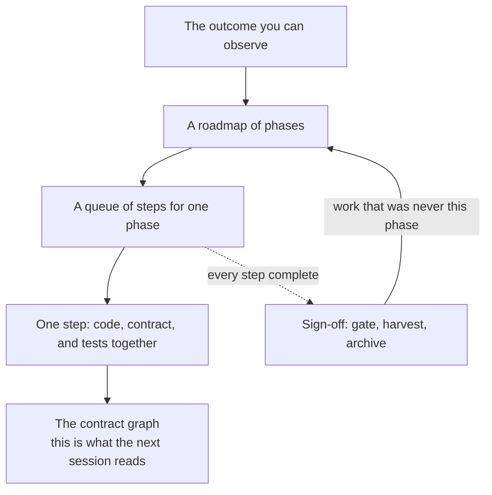

# Workflow

How a programme of work is split, run, and left behind so the **next** session can start from the
repository rather than from yesterday's chat.

The [lifecycle](lifecycle.md) lists the stages. This page is the shape of the work: what you
agree at each layer, what gets written, and what is still true after the plan is archived.

## Prototype before detailed delivery

When the desired experience needs hands-on exploration, start with `/cg-prototype`. It launches
the application, makes small changes, and iterates through your manual feedback while deferring
application test automation. Relevant contracts still guide placement and remain truthful; an
iteration that edits contract YAML runs `cg verify` immediately.

Explicit prototype acceptance leads to an Active roadmap and preparation of the actual provisional
code, without another plan invocation. The programme’s top-level `Status:` is `Proposed`, `Active`,
or `Complete`; phase-table statuses are `Current`, `Blocked`, `Complete`, or `Future`.
Normal produce completes its implementation and coverage; sign-off closes delivery. Prototype
acceptance never marks the initiative delivered. See [Prototype](prototype.md) for recovery,
review evidence, and optional merge protection.

## The decomposition stack

For a sufficiently understood outcome, a change is split four times before delivery code moves. Each split answers one
question. A later stage may refine *how* the work is allocated. It should not quietly change the
question already answered.

```text
what should be true when we are done
  → ordered phases                         plan
      → ordered steps in one phase         prepare
          → one change                     produce
              → code + contracts + tests   the lasting baseline
```



On a repository that already has code, **warmup** runs *before* this stack. It writes
contracts for the structure that exists, and records splits the code does not yet have. Those
splits become a plan you validate. After a later package upgrade, the same skill **reseeds**
an already-governed graph additively: missing children, product rules, and route targets.
It does not rewrite existing purpose or P IDs, and it does not rewrite the product.

## What you agree at each layer

| Stage | You are agreeing | You are not yet deciding |
|---|---|---|
| Prototype | The working experience after manual review, then the remaining delivery roadmap | Acceptance does not prove production readiness |
| Plan | Ordered phase outcomes, dependencies, and what “done” looks like for each phase | Which files move, which branch, which implementation |
| Prepare | The steps for **one** selected phase: paths, dependencies, and the command that proves each step | A new phase outcome — that is a return to plan |
| Produce | The implementation of the current step, and contracts that describe **what is true now** | A new split the step did not name |
| Sign-off | Whether the phase gate passed; what to keep as durable record; work that belongs in another phase | Fixing a behaviour or contract defect only in documentation |

Unblock sits beside this stack. Existing accepted decisions settle questions within their scope.
When a user decision remains, the agent records the context, viable options, tradeoffs and
recommendation, then asks directly in chat or interaction mode. You can select an option or type
another solution. Your response and its scoped interpretation are recorded against the same
stable decision entry. Independent work continues when the host supports asynchronous questions;
dependent work resumes after the answer is recorded and all its blockers are cleared. Silence or
a preselected recommendation is never approval.

The decision log is written **before** the question is presented. If you abandon the session,
a new one reads pending entries and presents the same unanswered questions with their existing
IDs. It also reads saved answers before deciding what can resume. Neither the question nor its
resolution depends on retaining the previous chat.

A fixable defect does not stop auto-run. If a rendering failure needs a corrective Step, the
Engineer prepares that repair, implements it, and reruns the evidence. The phase stays incomplete,
but its corrective route advances. A handoff's `Blocked by` field is reserved for a condition
that prevents the next action itself, such as an unanswered user decision or unavailable access.
Dependent evidence waits for the verified repair; adding the Step alone does not make it ready.
The optional stage gate permits preparation to repair selected queue syntax and misplaced Step
gates even when that queue cannot execute yet. Production and phase sign-off remain gated by readiness, and standalone skills
still yield at their stage boundary unless auto-run or the selected prototype's recorded
sign-off completion path is authorized. That prototype entry coordinates remaining delivery;
it does not waive UX acceptance, queue readiness, or final gates. See [prototype](prototype.md).

A resolved decision is authority within its scope until promoted, superseded, or dropped with a
reason. Later decisions can reference the constraints they depend on. Sign-off checks that the
implementation follows the accepted choices and preserves evidence still needed by active work.
Permanent contracts state enduring rules directly; they cannot cite plan or decision-log IDs as
the source of those rules.
`cg verify` fails a contract that cites a plan path or ticket id as its authority.

## Auto-run roles and context

Auto-run is optional. Manager and Engineer exist only under `/cg-auto-run`. Standalone
`/cg-plan` and `/cg-produce` are skills you invoke; they are not those roles. A new chat for
Produce after the Plan is on disk is ordinary isolation, not a Manager.

Its **Manager** maintains programme continuity and coordinates one **Engineer** per phase. The
Engineer reads the Plan directly, including programme intent and constraints, its full phase
and acceptance criteria, and relevant prerequisite evidence. It then routes through contracts
and loads implementation and skills as needed. It retains that context through preparation,
sequential execution, repairs and sign-off. That discrete agent is one phase, not one stage.

The Engineer asks its Manager for clarification first. The Manager checks the Plan and accepted
decisions, and asks you when a new user choice is needed. It records your answer and sends the
resolution back so the same Engineer can resume. The Manager owns decision-log writes; the
Engineer owns phase queue and implementation writes. A prepared harvest drain uses an explicit
`harvest.auto-run.md` so the two roles never write the log concurrently.

After sign-off, the Engineer returns verification evidence, durable-record links, unresolved
matters and scoped implications for later phases. The Manager accepts the phase from a closed
disk checklist (sign-off artifact, archived queue, gate stdout, `cg verify`, Next action with
no `Blocked by`) before starting the next Engineer. It does not duplicate implementation
review. Durable truth stays in contracts, specifications and decision records; neither role
relies on the previous chat as its only memory. A failed phase stays with its Engineer for
correction. When source sign-off requires an accepted harvest destination to be prepared first,
the Manager can coordinate that preparation while the source Engineer pauses; destination
execution still waits for source closure and sufficient authority and host support are required.

You may select the Manager and Engineer models and reasoning settings separately in your run
request, with explicit phase overrides if needed. Auto-run records those choices and uses the
host's actual controls; writing a model name into a skill does not select it. Without explicit
choices it retains host defaults. Unsupported requested settings are reported rather than silently
substituted. No universal model-selection CLI or agent runtime ships with Contract Graph.

Fresh workers and live questions depend on the host. Where workers are unavailable, Auto-Run
stops unless the invocation names `mixed-context`; that sequential fallback does not isolate
context. If you require fresh workers, an unsupported host is a blocker. Where asynchronous
input is unavailable, the run checkpoints and yields for your answer. Context isolation is
intended to reduce accumulated context across phases; token savings have not been established
by benchmarks. Use an explicit `**Status:** Closed` field only after acceptance and cleanup
reconciliation. Persist queued answers in the decision log and resolve worker ownership
before deletion. Cancellation or authority exhaustion retains Suspended recovery state
when those conditions are unmet; it never discards the only copy of an answer. Closed
ledgers are deleted, not archived, after any requested external evidence capture.

## How a plan is executed

**Plan** writes a roadmap under your docs tree (default `docs/plans/<programme>/roadmap.md`).
Each phase has one observable outcome and one acceptance gate. Phases do not own files. The
roadmap is the sequence you agreed. It is not current product behaviour. Current behaviour stays
in `contract.yaml`.

**Prepare** turns one selected phase into a queue:
`<docs>/plans/<programme>/<phase>_detailed_preparation.md`. Each step names what it may change,
what it depends on, what blocks it, and the command that proves it. Priority is only a tie-break
among ready work. Real constraints are explicit dependencies, so a blocked step does not freeze
an independent later step.

**Produce** runs the earliest ready step from the last verified state, or the explicitly measured
prototype baseline admitted for its first corrective Step. Code, tests, and any
contract change for that step land together. When the step's gate and `cg verify` pass, that
handoff **is** the starting point for the next ready step. Produce continues through ready work
until the queue is drained or nothing is ready.

**Sign-off** runs when every step in the phase is complete. If the phase gate passes, transient
plan files for that phase are archived. Knowledge that must survive goes into contracts, product
rules, or durable docs — not into a plan you are about to delete. A defect that is still this
phase's behaviour returns to produce. A finding that was never this phase returns to plan.

## Verification without duplicate work

Preparation assigns checks for the changed promises, applicable detectors, and affected consumers.
Produce executes that assignment. Sign-off uses one final evidence inventory for Step obligations,
composition, and the full repository gate. Checks run again when relevant inputs change or their
applicability is uncertain; a stage transition alone does not invalidate a recorded result.

Coverage follows changed behavior and invariants, rather than requiring a new test file for every
class. Existing sufficient coverage can be retained. Internal edits with unchanged contract facts
need an impact assessment but no artificial YAML change. Repository-required gates remain binding;
Contract Graph does not yet calculate safe implementation impact automatically.

## What the next session is supposed to trust

A later session should not need the previous chat. It should be able to route through the
**contract graph**, see remaining work on the **roadmap and queue**, and take accepted **resolved
decisions** as settled until they are promoted or dropped.

| Lasting | Temporary |
|---|---|
| `contract.yaml` nodes, edges, routes, invariants | Roadmaps and step queues (archive at close, then delete) |
| Architecture bindings (`A`) and product rules (`P`) | Auto-run ledgers (delete after acceptance and reconciliation; retain Suspended recovery state; do not archive) |
| Durable records under `docs/decisions/` and `docs/guides/` | Warmup findings once adoption has finished; a reseed delta after the owner has read it |
| The decision log *file* (entries drain; the ledger remains) | A decision *id* as the source of a contract rule |

If deleting `docs/plans/` would lose a rule, the rule was stored in the wrong place.

After a green step, the baseline is the pair **code that exists** and **graph that describes it**.
The next step, and the next person or agent, starts from that pair.

## Seeing where you are

These commands inspect the same disk state the stages use. They do not require the last chat.

| Command | What it tells you |
|---|---|
| `cg next` | Which stage owns the next move, from the step headers on disk |
| `cg status --programme <slug>` | Current Steps, blockers, recovery action, and residue owners, read from disk |
| `cg residue [--programme <slug>]` | Unreferenced plan files; scoped checks include shared/unassigned files and list other owners |
| `cg verify` | Whether the authored graph is closed — not yet whether every import matches it |
| `cg graph show` | A projection of the contract graph |
| `cg contract route --task "…"` | Which contracts a request should load first |

`cg init --docs` can place plans somewhere other than `docs/`. `cg residue` prints the plans
directory that is actually in use.

## Related

- [Vision](vision.md) — why the graph exists.
- [Contracts](contracts.md) — node shape and what verification proves today.
- [Lifecycle](lifecycle.md) — the stages and the structural walk they share.
- [Upgrade](upgrade.md) — 0.3.0 / 0.4.0 → 0.5.0: `cg init`, then adoption or reseed.
