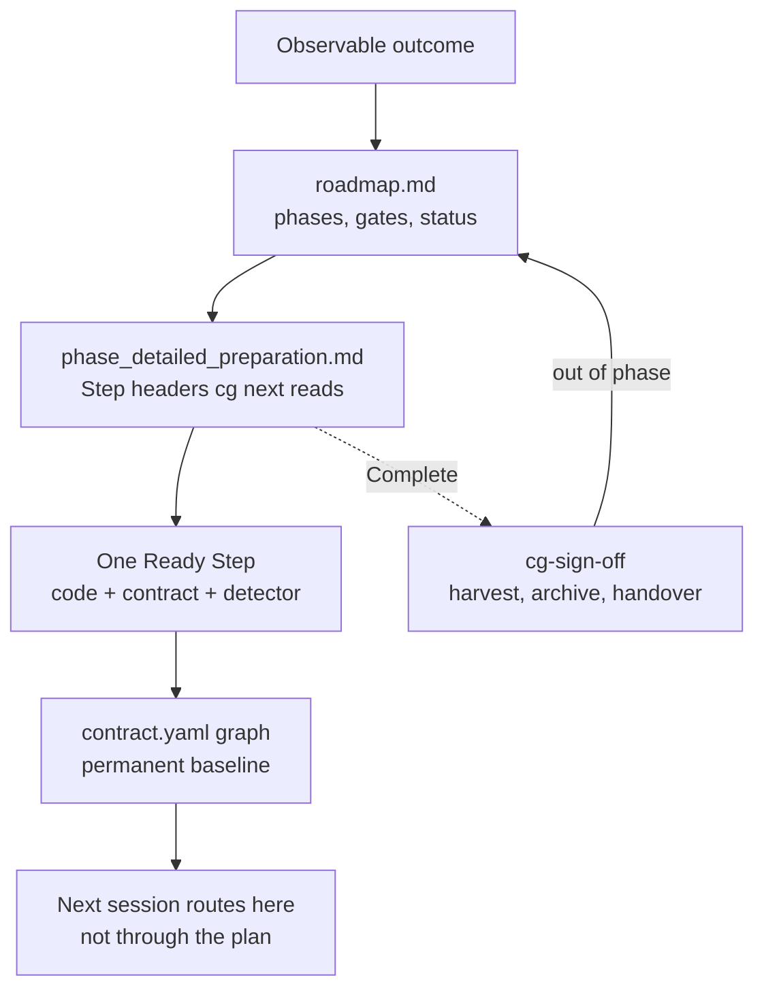

# Workflow

How a Contract Graph programme is decomposed, executed, and left as the next session's baseline.

The [lifecycle](lifecycle.md) names the seven skills and the `graph` walk they apply. This page
names the **artifacts those skills write**, how one layer is not allowed to do the next layer's
job, and which files a later agent is supposed to trust. Chat history is not one of them.

Two different files are called "workflow":

| File | Audience | Job |
|---|---|---|
| `.agents/cg/workflow.md` after `cg init` | every code task in an adopting repo | required delivery sequence; preserved by later inits |
| this page | humans and agents learning the product | how programmes shrink from outcome to verified structure |

The installed file must not replace `architecture.yaml` `graph`. This page must not pretend the
verifier already proves source imports match every declared edge.

## The decomposition stack

Work is split four times before a line of production code is supposed to move. Each split answers
one question and writes one class of artifact. A later stage may refine allocation; it may not
quietly change the question already answered.

```text
product or architecture outcome
  → programme (ordered phases)          cg-plan
      → one phase (ordered Steps)       cg-prepare
          → one Step (one change)       cg-produce
              → verified graph + code   contracts, tests, detectors
```



Warmup sits **before** this stack: it writes the first truthful graph from existing code and, when
`graph` requires a shape the code does not have, a corrective set for `cg-plan`. It does not
execute the restructure.

## What each layer may decide

| Layer | May decide | Must not decide |
|---|---|---|
| `cg-plan` | ordered phase outcomes, dependencies, acceptance gates, status `Current` / `Blocked` / `Complete` / `Future` | file lists, Step briefs, branches, implementation |
| `cg-prepare` | which paths, contracts, and detectors each Step owns; explicit `Depends on`; one phase branch; `Done when` | a new phase outcome or gate — that returns to plan |
| `cg-produce` | how to implement the brief; contract text that states **current** truth | a new split the brief did not name, or `$cg-plan` |
| `cg-sign-off` | whether the phase gate passed; harvest classification; durable docs; out-of-phase handovers | repairing a behaviour/contract defect as documentation |

`cg-unblock` is orthogonal. It classifies a fork so the queue can keep moving. A resolved
`DU-NN` / `DA-NN` entry becomes D-2 authority **above** the walking skeleton. It still must not
be cited from a contract as the source of a rule; promotion copies the constraint into a contract,
`P`, or (in the verifier-owning change) `A`.

`cg-auto-run` is an adapter, not a fifth layer. It dispatches the stages above. It adds no `graph`
or `E` rules.

## How a plan is executed

### 1. Plan writes a transient programme

`cg-plan` writes `<docs>/plans/<programme>/roadmap.md`. The docs root comes from
`.agents/cg/profile.json` `docs` (default `docs`); `cg residue` prints `<docs>/plans/`.

The roadmap is the owner's agreed sequence. Each phase has one observable outcome and one
acceptance gate. Phases do not own files. If warmup left `<docs>/plans/warmup-corrective-set.md`
Unconsumed, that file is restructure input: Architecture target and cited `E` ids travel with the
finding. Uncited `E` entries do not invent extra phases.

The roadmap is **not** current behavior. Current behavior stays in `contract.yaml`. `cg verify`
fails a contract that cites a plan path or ticket id as a rule.

### 2. Prepare decomposes one phase into a queue

Preparation is admitted only when one phase is selected and its outcome is stable. It applies
`graph` to assign paths to the **accepted** target: mixed code that matches that target is the
work, not a reason to return to plan.

It writes `<docs>/plans/<programme>/<phase>_detailed_preparation.md` containing `## Step <n>`
sections. `cg next` parses **only the header block** of each section:

```text
Priority: <integer>
Depends on: <Step N | None>
Blocked by: <DU-NN or external prerequisite | None>
Status: Waiting | Ready | Blocked | In progress | Complete
```

Everything below the first `###` is brief prose for produce. A `Status:` line in that prose is
not the Step's state.

Priority is a tie-break among Ready Steps, not an implicit dependency. Real constraints are
declared on `Depends on`. That is why a blocked Step 2 does not freeze an independent Step 3.

Prepare records required contract changes; it does not write the contracts. A new self-sufficient
unit's contract is owed by the Step that creates the unit.

### 3. Produce executes Ready work against the last verified state

`cg-produce` starts from:

- the Step brief (editable paths, required contract changes, `Done when`);
- the latest verified phase state plus named prerequisite handoffs;
- the contracts `cg contract route` selected for the Step goal.

It applies `graph` before editing. If the brief **is** the add-child / elsewhere / adapter split,
still-mixed code is the starting state and the Step runs. If the brief is stuffing new behaviour
into the mixed node, it stops with `$cg-prepare`. It does not emit `$cg-plan`.

One Step is `In progress` at a time. Contract, detector, implementation, and tests are one
delivery. After a green `Done when` and `cg verify`, the Step is `Complete`, the queue is
recalculated, and **every remaining `Ready` Step is drained in the same invocation**.

The handoff **is** the next Step's baseline: the commit or exact worktree state the brief said
dependents would consume. A later Step that repeats a path must state what the earlier Step left
behind.

### 4. Sign-off closes the phase or returns work

When `cg next` reports every Step `Complete`, `cg-sign-off` runs the phase gate, composition
checks, and decision harvest. In-phase behaviour or contract defects become a corrective produce
Step. A genuinely out-of-phase finding is a handover to plan, not a silent archive.

Green close archives the phase's transient files under `<docs>/plans/archive/` and updates
roadmap links. Durable knowledge leaves plans: `docs/decisions/`, `docs/guides/`, and the
contracts themselves. The decision log file stays; eligible entries drain through harvest.

## What becomes the baseline

A new session is not supposed to reconstruct the programme from chat. It is supposed to read
**measured state on disk**, in this order:

| Trust first | Artifact | Why |
|---|---|---|
| 1 | `.agents/cg/contract.yaml` and connected `contract.yaml` nodes | permanent structure and routes |
| 2 | `.agents/cg/principles/architecture.yaml` `graph` and `A` | node decision and global bindings |
| 3 | scoped `P` on those contracts | product bindings |
| 4 | `<docs>/plans/decision-log.md` *Resolved* entries | accepted forks until promoted or dropped |
| 5 | active `roadmap.md` and the selected phase queue | transient remaining work |
| 6 | `cg next` | independent answer for which stage owns the next move |
| 7 | `E` in `engineering.yaml` | remaining design judgement only |

Pending `DU-NN` entries are not authority. An `E` disagreement is not a compliance failure and
not `Blocked by`.

After produce, the **graph that describes the code that now exists** is the baseline for the next
Step and the next session. After sign-off, harvested rules must live in a contract, `P`, or `A`
candidate — not in the archived plan — or they vanish when the plan is deleted.

```text
route through contracts
  → smallest responsible boundary
  → change only what the Step allocated
  → update that boundary's graph facts
  → verify code and graph together
  → next Step / next session starts from that pair
```

## Under the hood

### `cg next` is not the model's Next action

Stages end with a `Next action` block whose `Next input` leads with a `$cg-` token so a human or
`cg-auto-run` can follow it. That block is the model's account of where it is.

`cg next` computes the same question from the Step headers on disk. Two sources that must agree
is enforcement; one source is a convention. The Claude Code gate compares a requested skill with
`cg next --for <skill>`. Unblock, plan, warmup, and auto-run are never gated that way: they are
how a blocked or unplanned repository starts moving.

Selection rule, implemented in `src/scripts/next.js`:

1. no `*_detailed_preparation.md` → `cg-prepare`;
2. a Step is `In progress` → `cg-produce` on that Step;
3. earliest `Ready` Step whose `Depends on` are all `Complete` → `cg-produce`;
4. every Step `Complete` → `cg-sign-off`;
5. otherwise → `cg-unblock`.

### Stage boundary

A stage finishes its job and yields. It does not invoke the next skill because the route looks
obvious. `cg-auto-run` is the exception: it has a granted authority, a twelve-dispatch budget
(about three clean phases plus slack), and a ledger under `<docs>/plans/auto-run/`. It never
auto-dispatches warmup or unblock. After three `Phase complete` headings it stops even if budget
remains; remaining phases are a fresh run from the ledger.

`Blocked by` on a Next action block is the single stop signal. Auto-run does not follow it.

### Residue

`cg residue` walks `<docs>/plans/` the way the contract graph is walked: from roadmap roots.
Linked files are live working state. Unlinked files and empty directories are residue. `archive/`
and `auto-run/` are exempt. Warmup's three files are live until warmup has actually finished.

That is how the transient tree is supposed to **shrink**. The permanent tree is the contract
graph, which is supposed to **accumulate truth**, not plans.

### Verification in the loop

Each produce Step runs its `Done when` and `cg verify`. `cg verify` proves the authored graph is
closed: schema, reciprocity, acyclicity, root reachability, declared surfaces, rule ids,
invariant/verification pairing, no plan citations. It does not yet prove the source contains no
undeclared child, that every export matches the surface, or that imports obey every edge.

A `test -f` command is not a detector. Warmup and produce both refuse path-existence checks as
verification.

## Adoption and the first baseline

On a brownfield repository, `cg-warmup` is the first writer of the baseline. It maps module
roots, writes contracts for the code that is there, and records `graph` findings the code cannot
satisfy yet. Those findings are a programme the owner validates through `cg-plan`; they are not
a rewrite performed in warmup.

After warmup, later sessions should not re-read the whole tree to rediscover boundaries. They
route, then read the smallest implementation the route named.

## Related

- [Vision](vision.md) — why the graph exists and the causal order of a loop.
- [Contracts](contracts.md) — YAML node shape, invariants, and current verifier limits.
- [Lifecycle](lifecycle.md) — `graph` walk keys and the seven skills.
- Installed `.agents/cg/workflow.md` — the adopting repository's required task sequence.
