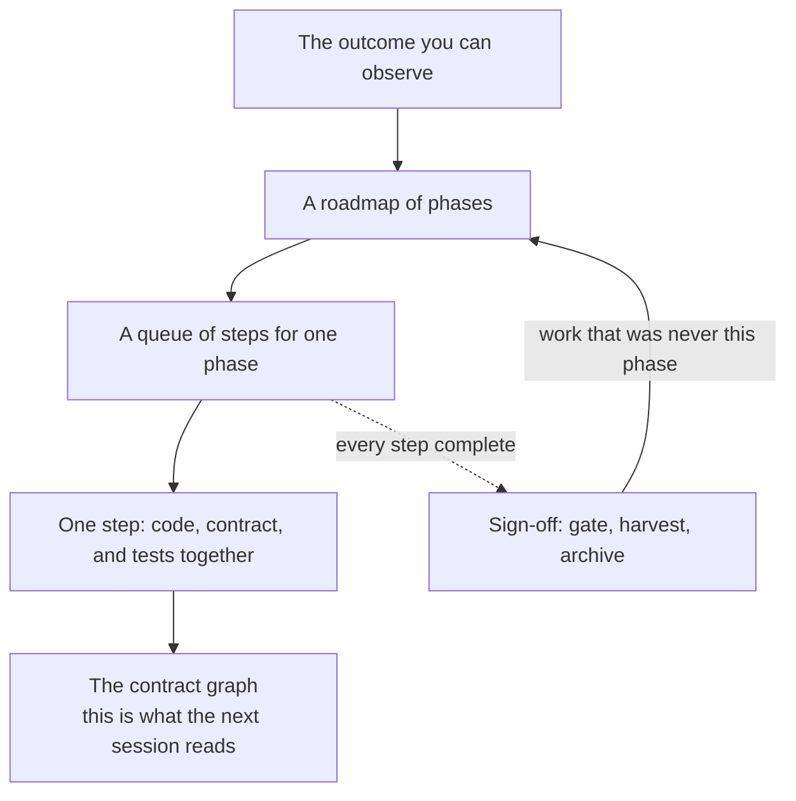

# Workflow

How a programme of work is split, run, and left behind so the **next** session can start from the
repository rather than from yesterday's chat.

The [lifecycle](lifecycle.md) lists the stages. This page is the shape of the work: what you
agree at each layer, what gets written, and what is still true after the plan is archived.

## The decomposition stack

A change is split four times before production code is supposed to move. Each split answers one
question. A later stage may refine *how* the work is allocated. It should not quietly change the
question already answered.

```text
what should be true when we are done
  → ordered phases                         plan
      → ordered steps in one phase         prepare
          → one change                     produce
              → code + contracts + tests   the lasting baseline
```



On a repository that already has code, **warmup** runs *before* this stack. It writes
contracts for the structure that exists, and records splits the code does not yet have. Those
splits become a plan you validate. After a later package upgrade, the same skill **reseeds**
an already-governed graph additively: missing children, product rules, and route targets.
It does not rewrite existing purpose or P IDs, and it does not rewrite the product.

## What you agree at each layer

| Stage | You are agreeing | You are not yet deciding |
|---|---|---|
| Plan | Ordered phase outcomes, dependencies, and what “done” looks like for each phase | Which files move, which branch, which implementation |
| Prepare | The steps for **one** selected phase: paths, dependencies, and the command that proves each step | A new phase outcome — that is a return to plan |
| Produce | The implementation of the current step, and contracts that describe **what is true now** | A new split the step did not name |
| Sign-off | Whether the phase gate passed; what to keep as durable record; work that belongs in another phase | Fixing a behaviour or contract defect only in documentation |

Unblock sits beside this stack. When a choice is expensive or protected, it is logged so other
steps can continue. A resolved decision is real authority until it is promoted into a contract or
a product rule — or dropped with a reason. Plans and decision-log ids are not something a
contract may cite as the source of a rule; `cg verify` fails a contract that cites a plan path or ticket id.

Auto-run is optional. It follows an already-planned roadmap through remaining planned phases,
and stops on blockers or owner decisions rather than a phase or dispatch count. It does not
invent the plan, and it does not settle owner decisions.

## How a plan is executed

**Plan** writes a roadmap under your docs tree (default `docs/plans/<programme>/roadmap.md`).
Each phase has one observable outcome and one acceptance gate. Phases do not own files. The
roadmap is the sequence you agreed. It is not current product behaviour. Current behaviour stays
in `contract.yaml`.

**Prepare** turns one selected phase into a queue:
`<docs>/plans/<programme>/<phase>_detailed_preparation.md`. Each step names what it may change,
what it depends on, what blocks it, and the command that proves it. Priority is only a tie-break
among ready work. Real constraints are explicit dependencies, so a blocked step does not freeze
an independent later step.

**Produce** runs the earliest ready step from the last verified state. Code, tests, and any
contract change for that step land together. When the step's gate and `cg verify` pass, that
handoff **is** the starting point for the next ready step. Produce continues through ready work
until the queue is drained or nothing is ready.

**Sign-off** runs when every step in the phase is complete. If the phase gate passes, transient
plan files for that phase are archived. Knowledge that must survive goes into contracts, product
rules, or durable docs — not into a plan you are about to delete. A defect that is still this
phase's behaviour returns to produce. A finding that was never this phase returns to plan.

## What the next session is supposed to trust

A later session should not need the previous chat. It should be able to route through the
**contract graph**, see remaining work on the **roadmap and queue**, and take accepted **resolved
decisions** as settled until they are promoted or dropped.

| Lasting | Temporary |
|---|---|
| `contract.yaml` nodes, edges, routes, invariants | Roadmaps and step queues |
| Architecture bindings (`A`) and product rules (`P`) | Auto-run ledgers |
| Durable records under `docs/decisions/` and `docs/guides/` | Warmup findings once adoption has finished; a reseed delta after the owner has read it |
| The decision log *file* (entries drain; the ledger remains) | A decision *id* as the source of a contract rule |

If deleting `docs/plans/` would lose a rule, the rule was stored in the wrong place.

After a green step, the baseline is the pair **code that exists** and **graph that describes it**.
The next step, and the next person or agent, starts from that pair.

## Seeing where you are

These commands inspect the same disk state the stages use. They do not require the last chat.

| Command | What it tells you |
|---|---|
| `cg next` | Which stage owns the next move, from the step headers on disk |
| `cg residue` | Plan files nothing still links to (your docs root, default `docs/plans/`) |
| `cg verify` | Whether the authored graph is closed — not yet whether every import matches it |
| `cg graph show` | A projection of the contract graph |
| `cg contract route --task "…"` | Which contracts a request should load first |

`cg init --docs` can place plans somewhere other than `docs/`. `cg residue` prints the plans
directory that is actually in use.

## Related

- [Vision](vision.md) — why the graph exists.
- [Contracts](contracts.md) — node shape and what verification proves today.
- [Lifecycle](lifecycle.md) — the stages and the structural walk they share.
- [Upgrade](upgrade.md) — 0.3.0 / 0.4.0 → 0.5.0: `cg init`, then adoption or reseed.
