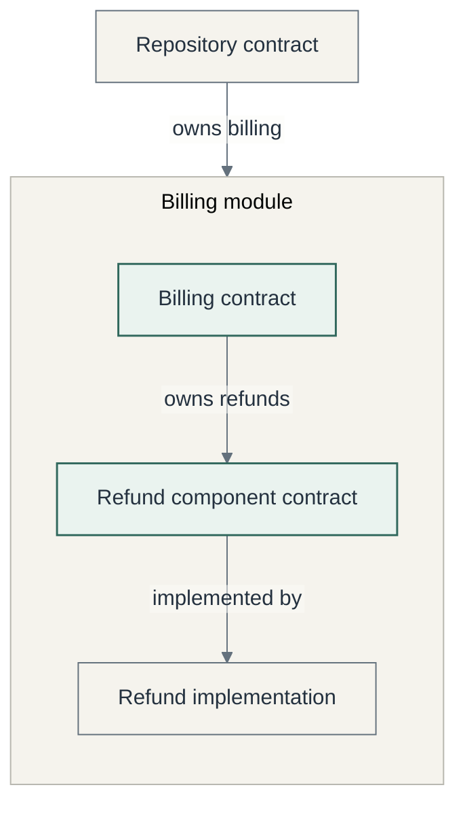
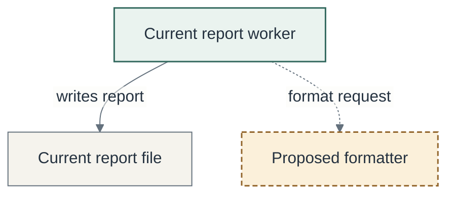
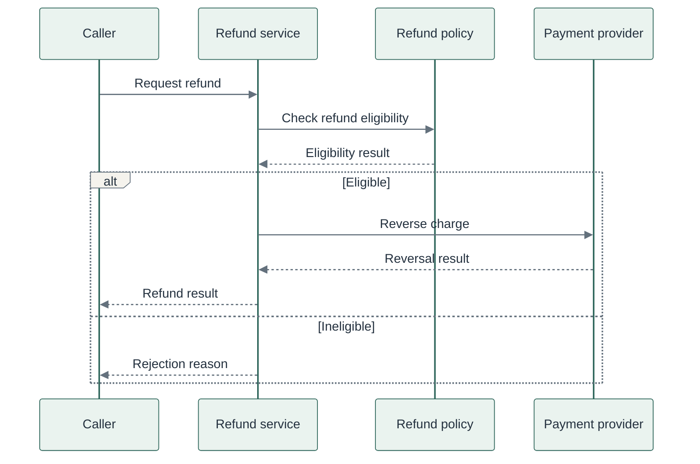

# Mermaid starting examples

These examples describe hypothetical software. They are syntax and composition examples, not
claims about the adopting repository. Replace the names, relationships, and caption with facts
from the selected contracts. Load only the example matching the reader's question.

The palette is optional and uses Mermaid's base theme without CSS overrides. The examples use
configuration frontmatter; check support in the destination renderer. If configuration is stripped,
use the host theme and retain the status words and relationship labels. Flowcharts use SVG text
labels to avoid dependence on HTML label styling. Keep only the classes used in the final diagram.

## Contract ownership overview

Example: a repository delegates refunds through a billing module to its refund component.
The arrows describe ownership and implementation, not the order of a refund request.

The refund component is the narrower starting point for a refund change. Its parent explains
where that responsibility fits; source inspection establishes how the promise is implemented.

## Current responsibility and proposed extraction

Example proposal: a report worker currently formats and saves reports. A proposed formatter
would own formatting, leaving persistence with the worker. Dashed arrows describe the proposal.

The formatter is a proposed responsibility boundary. This illustration does not establish that
the extraction is implemented, accepted, or verified.

## One operation across public surfaces

Example interaction: a caller requests a refund; the refund service checks its policy and asks
the payment provider to reverse the charge. Include only the failure cases relevant to the contract.

The refund service coordinates the operation through named public surfaces. The policy owns
eligibility; the provider performs the reversal. This sequence does not itself prove either
component's behavior or error handling.
